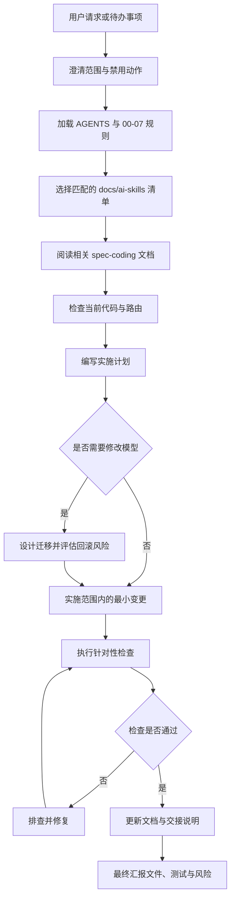
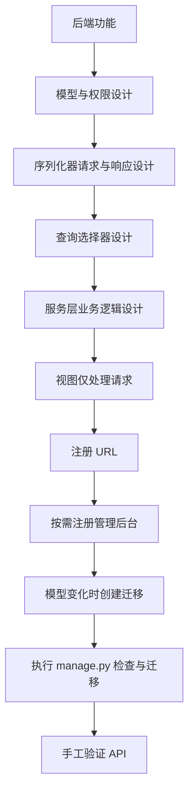
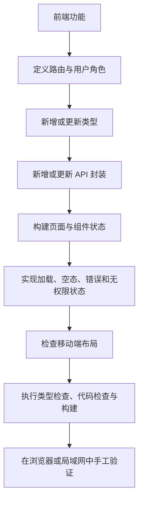
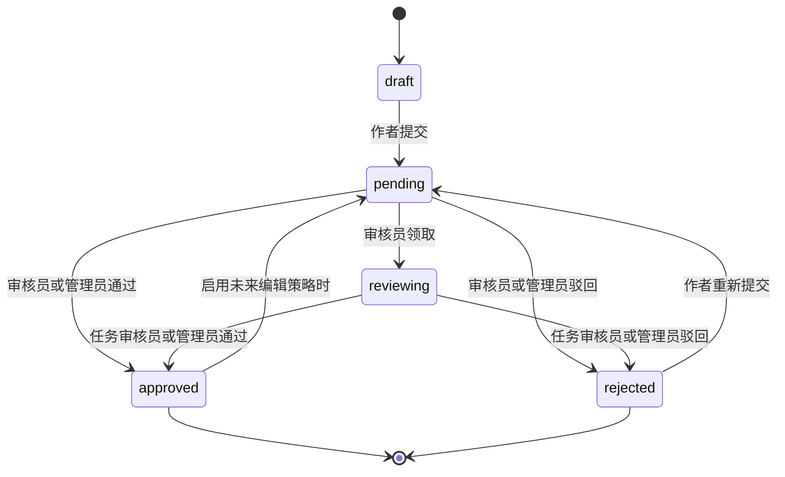

# 开发流程

本文档定义后续任务在设计、实现、测试和文档更新方面应遵循的标准流程。

## 1. 标准功能流程

## 2. 后端功能流程

规则：

- 查询逻辑放在 `selectors.py`。
- 写操作与业务逻辑放在 `services.py`。
- 输入校验放在序列化器中。
- 视图应保持精简。
- 响应封装必须保持稳定。
- 受保护接口必须在后端强制执行权限检查。

## 3. 前端功能流程

规则：

- API 调用应使用 `apps/web/src/lib/api/request.ts`。
- 页面负责数据加载与状态管理。
- 共享组件不得执行隐藏的 API 调用。
- 公开页面必须在未登录状态下正常工作。
- 受保护页面必须明确处理令牌缺失或过期情况。

## 4. 内容审核流程

审计规则：

- `submit`、`claim`、`approve`、`reject` 操作应创建 `AuditLog`。
- `reviewer` 与 `reviewed_at` 应保留任务归属与历史信息。
- 普通审核员只能完成自己领取的 `reviewing` 任务。
- 管理员、职员和超级用户可以处理所有任务。

## 5. 发布流程

最低发布门禁：

- 前端：
  - `npx.cmd tsc --noEmit --incremental false`
  - `npm.cmd run lint`
  - `npm.cmd run build`
- 后端：
  - `.\.venv\Scripts\python.exe manage.py check`
  - 不应产生迁移时执行 `.\.venv\Scripts\python.exe manage.py makemigrations --check --dry-run`。
  - 需要迁移时执行 `.\.venv\Scripts\python.exe manage.py migrate`。

## 6. 文档更新流程

每次完成有实际意义的功能后：

1. 路由、模型或页面发生变化时更新 `01-current-state.md`。
2. 功能行为发生变化时更新 `02-feature-spec.md`。
3. 优先级或完成状态发生变化时更新 `03-roadmap.md`。
4. 测试用例或命令发生变化时更新 `05-testing-plan.md`。
5. API 或权限发生变化时更新 `06-api-data-contract.md`。
6. 只有交接格式本身发生变化时才更新 `08-context-handoff-template.md`。
7. 提示类文档的新增或修改说明文字必须使用简体中文。

## 7. 停止条件

出现以下情况时，停止实施并请求明确批准：

- 需要修改 API 响应封装。
- 需要修改现有路由路径。
- 需要删除或重命名数据库字段。
- 需要修改身份认证或令牌策略。
- 需要增加支付或安全敏感功能。
- 需要执行破坏性迁移或数据清理。
- 需要在用户请求之外修改现有用户数据。
