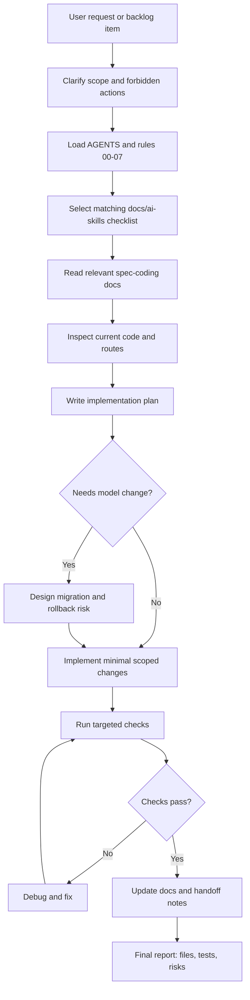
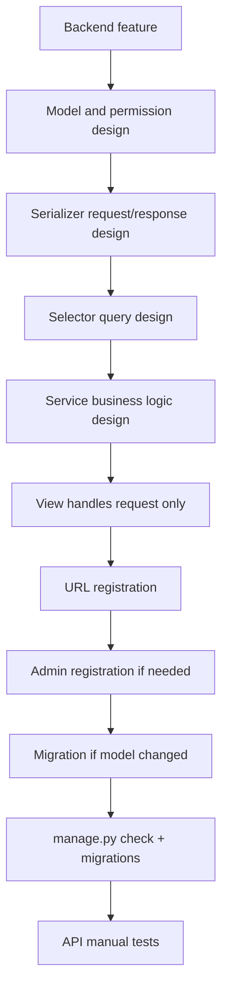
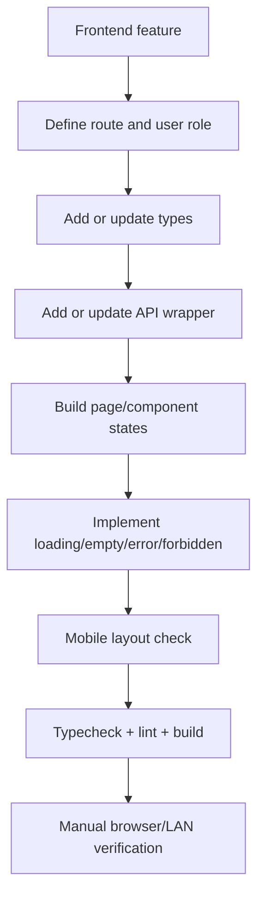
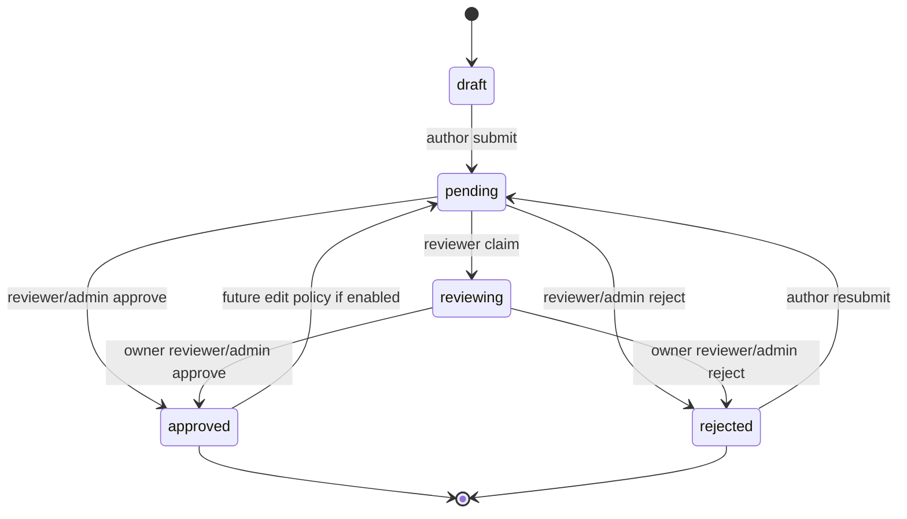
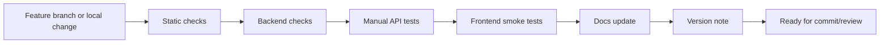

# Development Flow

This document defines the standard flow for designing, implementing, testing, and documenting future work.

## 1. Standard Feature Flow

## 2. Backend Feature Flow

Rules:

- Query logic belongs in `selectors.py`.
- Write/business logic belongs in `services.py`.
- Validation belongs in serializers.
- Views should remain thin.
- Response envelope must remain stable.
- Protected endpoints must enforce backend permissions.

## 3. Frontend Feature Flow

Rules:

- API calls should use `apps/web/src/lib/api/request.ts`.
- Pages own data loading and state.
- Shared components should not perform hidden API calls.
- Public pages must work without login.
- Protected pages must handle missing/expired token clearly.

## 4. Content Review Flow

Audit rules:

- `submit`, `claim`, `approve`, `reject` should create `AuditLog`.
- `reviewer` and `reviewed_at` should preserve task ownership/history.
- Regular reviewer can only finish own `reviewing` task.
- Admin/staff/superuser can handle all.

## 5. Release Flow

Minimum release gates:

- Frontend:
  - `npx.cmd tsc --noEmit --incremental false`
  - `npm.cmd run lint`
  - `npm.cmd run build`
- Backend:
  - `.\.venv\Scripts\python.exe manage.py check`
  - `.\.venv\Scripts\python.exe manage.py makemigrations --check --dry-run` when no migration is expected.
  - `.\.venv\Scripts\python.exe manage.py migrate` when migration is expected.

## 6. Documentation Update Flow

After every meaningful feature:

1. Update `01-current-state.md` if routes/models/pages changed.
2. Update `02-feature-spec.md` if functional behavior changed.
3. Update `03-roadmap.md` if priority or completion changes.
4. Update `05-testing-plan.md` if test cases or commands changed.
5. Update `06-api-data-contract.md` if API or permissions changed.
6. Update `08-context-handoff-template.md` only if handoff format itself changes.

## 7. Stop Conditions

Stop and ask for explicit approval when:

- API envelope would change.
- Existing route path would change.
- Database field would be removed or renamed.
- Auth/token strategy would change.
- Payment/security-sensitive functionality is added.
- A destructive migration or data cleanup is needed.
- Existing user data would be modified outside a requested operation.
