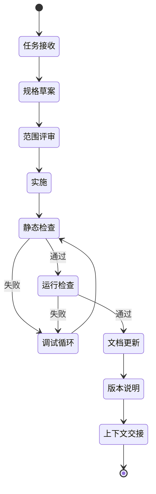
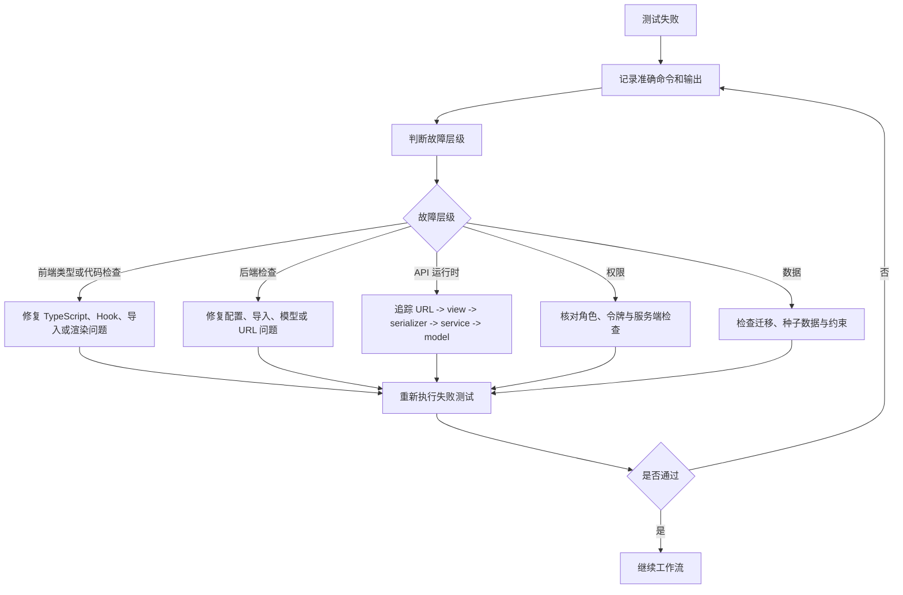

# 自动迭代工作流计划

本文档设计未来可落地的自动迭代工作流。本文只定义计划，不实现任何自动化。

## 1. 目标

建立一个可重复执行的工作流，能够：

1. 接收功能需求。
2. 将需求转换为范围明确的规格。
3. 检查当前代码与文档。
4. 以增量方式实施变更。
5. 执行测试与调试循环。
6. 更新版本说明和项目文档。
7. 为下一轮迭代生成清晰的上下文交接信息。

## 2. 工作流原则

- 后端权限始终在服务端强制执行。
- 除非建立独立迁移任务，否则 API 响应封装必须保持稳定。
- 优先采用小步增量变更，避免大范围重写。
- 功能标记为完成前必须执行测试。
- 代码与相关文档必须在同一轮迭代中更新。
- 测试失败时必须进入调试循环，不得静默结束。
- 每轮迭代都必须生成上下文交接信息。
- 工作流及提示类文档的说明文字必须使用简体中文。

## 3. 规划的工作流状态



## 4. 工作流输入

必填项：

- 用户请求。
- 目标模块。
- 允许修改的文件或区域。
- 禁止执行的动作。
- 验收标准。

可选项：

- 截图。
- API 请求或响应示例。
- 现有错误日志。
- 优先级。
- 目标发布阶段。

## 5. 工作流产出

每轮迭代应产出：

- 变更文件清单。
- 行为变更摘要。
- 测试命令与结果。
- 剩余风险。
- 已更新的文档。
- 下一步建议任务。
- 上下文交接摘要。

## 6. 自动化代理检查清单

未来自动化应按以下步骤执行：

1. 阅读 `AGENTS.md`。
2. 按顺序阅读 `.cursor/rules/00` 到 `.cursor/rules/07`。
3. 阅读 `docs/spec-coding/README.md`。
4. 选择匹配的 `docs/ai-skills/*.md`。
5. 检查相关文件。
6. 制定实施计划。
7. 实施最小代码变更。
8. 执行验证。
9. 如果验证失败：
   - 记录准确错误。
   - 判断故障层级：前端、后端、API、数据、权限或环境。
   - 实施最小修复。
   - 重新执行验证。
10. 更新文档。
11. 生成最终交接信息。

## 7. 质量门禁

### 始终执行

- 不进行无关重构。
- 不执行脚手架或初始化命令。
- 未经批准不修改 API 响应封装。
- 未经批准不重命名路由。
- 不输出敏感令牌或密码。

### 前端门禁

```powershell
cd apps/web
npx.cmd tsc --noEmit --incremental false
npm.cmd run lint
```

发布前执行：

```powershell
npm.cmd run build
```

### 后端门禁

```powershell
cd services/api
.\.venv\Scripts\python.exe manage.py check
```

模型发生变化时执行：

```powershell
.\.venv\Scripts\python.exe manage.py makemigrations
.\.venv\Scripts\python.exe manage.py migrate
```

后端发生变化但模型未变化时执行：

```powershell
.\.venv\Scripts\python.exe manage.py makemigrations --check --dry-run
```

## 8. 调试循环设计



## 9. 版本规划

正式发布工具建立前，使用文档记录版本说明：

- `v0.x-dev`：开发里程碑。
- 版本说明必须包含：
  - 日期。
  - 任务范围。
  - 变更领域。
  - 是否需要迁移。
  - 已执行测试。
  - 已知风险。

未来自动化可以生成：

- `docs/spec-coding/version-notes/YYYY-MM-DD-feature.md`
- 变更日志条目。
- 迁移说明。

## 10. 工作项模板

```markdown
## 工作项

标题：
优先级：
领域：
允许修改的文件或区域：
禁止执行的动作：

### 用户故事

作为……
我希望……
从而……

### 验收标准

- [ ] ……

### API 变更

- 无，或列出接口。

### 数据变更

- 无，或列出模型与迁移。

### 测试

- 后端：
- 前端：
- 手工验证：

### 需要更新的文档

- [ ] ……
```

## 11. 未来自动化实现选项

以下内容当前尚未实现，但未来可以考虑：

1. 使用 GitHub Actions 或本地 PowerShell 任务运行器执行检查。
2. 编写脚本生成工作项目录。
3. 编写脚本运行前后端门禁。
4. 编写脚本将日志写入 `docs/spec-coding/runs/`。
5. 编写脚本校验 API 或模型变更时是否同步更新文档。
6. 使用 Playwright 对关键页面执行冒烟测试。
7. 为所有角色保护接口建立 DRF API 测试套件。

## 12. 自动化风险

- 没有文件范围约束的自动代码修改可能造成大范围回归。
- 未经评审自动迁移数据库可能破坏本地数据。
- 自动修改 API 契约可能在无明显提示的情况下破坏前端。
- 在不了解产品意图时自动修复测试，可能固化错误行为。

规则：

- 自动化可以提供辅助，但迁移、身份认证、支付和破坏性变更的最终状态转换必须获得人工明确批准。
