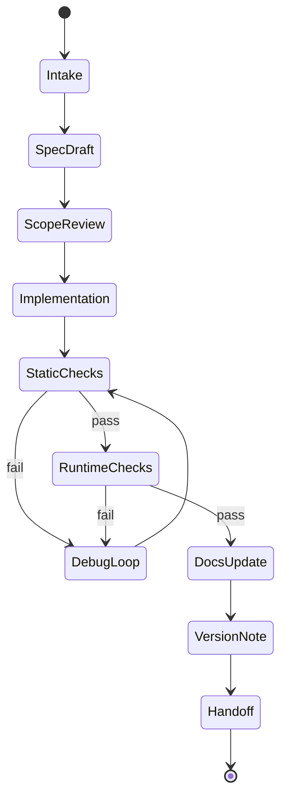
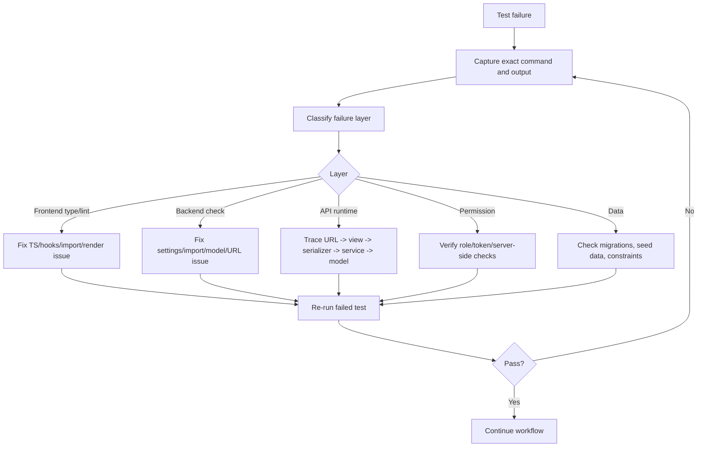

# Auto Iteration Workflow Plan

This document designs a future automated iteration workflow. It is a plan only; no automation is implemented by this document.

## 1. Goal

Build a repeatable workflow that can:

1. Accept a feature request.
2. Convert it into a scoped spec.
3. Inspect current code and docs.
4. Implement incrementally.
5. Run tests and debugging loops.
6. Update version notes and documentation.
7. Produce a clear handoff for the next iteration.

## 2. Workflow Principles

- Backend permissions are always enforced server-side.
- API envelope remains stable unless a migration task is created.
- Small increments are preferred over large rewrites.
- Tests must run before marking a feature complete.
- Docs must be updated in the same iteration as code.
- Failed tests trigger debug loop, not silent completion.
- Every iteration must produce a context handoff.

## 3. Proposed Workflow States



## 4. Workflow Inputs

Required:

- User request.
- Target module.
- Allowed files or allowed area.
- Forbidden actions.
- Acceptance criteria.

Optional:

- Screenshots.
- API payload examples.
- Existing bug logs.
- Priority.
- Desired release phase.

## 5. Workflow Outputs

Each iteration should produce:

- Changed files list.
- Behavior summary.
- Test commands and results.
- Remaining risks.
- Updated docs.
- Next recommended tasks.
- Context handoff summary.

## 6. Automated Agent Checklist

Future automation should run these steps:

1. Read `AGENTS.md`.
2. Read `.cursor/rules/00` to `07`.
3. Read `docs/spec-coding/README.md`.
4. Select matching `docs/ai-skills/*.md`.
5. Inspect relevant files.
6. Build a plan.
7. Apply minimal code changes.
8. Run verification.
9. If verification fails:
   - Capture exact error.
   - Identify layer: frontend, backend, API, data, permission, environment.
   - Fix minimally.
   - Re-run verification.
10. Update docs.
11. Produce final handoff.

## 7. Quality Gates

### Always

- No unrelated refactor.
- No scaffold/init commands.
- No API envelope changes without approval.
- No route renaming without approval.
- No sensitive token/password output.

### Frontend Gate

```powershell
cd apps/web
npx.cmd tsc --noEmit --incremental false
npm.cmd run lint
```

Before release:

```powershell
npm.cmd run build
```

### Backend Gate

```powershell
cd services/api
.\.venv\Scripts\python.exe manage.py check
```

If models changed:

```powershell
.\.venv\Scripts\python.exe manage.py makemigrations
.\.venv\Scripts\python.exe manage.py migrate
```

If models did not change but backend changed:

```powershell
.\.venv\Scripts\python.exe manage.py makemigrations --check --dry-run
```

## 8. Debug Loop Design



## 9. Versioning Plan

Until formal release tooling exists, use documentation version notes:

- `v0.x-dev`: development milestones.
- Version note should include:
  - Date.
  - Scope.
  - Changed domains.
  - Migration needed or not.
  - Tests run.
  - Known risks.

Future automation can generate:

- `docs/spec-coding/version-notes/YYYY-MM-DD-feature.md`
- changelog entries.
- migration notes.

## 10. Work Item Template

```markdown
## Work Item

Title:
Priority:
Domain:
Allowed files/areas:
Forbidden actions:

### User Story

As a ...
I want ...
So that ...

### Acceptance Criteria

- [ ] ...

### API Changes

- None / list endpoints.

### Data Changes

- None / list models and migrations.

### Tests

- Backend:
- Frontend:
- Manual:

### Docs To Update

- [ ] ...
```

## 11. Future Automation Implementation Options

Not implemented now, but possible later:

1. GitHub Actions or local PowerShell task runner for checks.
2. Script that generates work item folders.
3. Script that runs frontend/backend gates.
4. Script that captures logs into `docs/spec-coding/runs/`.
5. Script that validates docs updated for API/model changes.
6. Playwright smoke tests for key pages.
7. DRF API test suite for all role-protected endpoints.

## 12. Automation Risks

- Automatically modifying code without scoped file boundaries can cause broad regressions.
- Automatically migrating database without review can damage local data.
- Automatically changing API contracts can break frontend silently.
- Automatically fixing tests without understanding product intent can encode wrong behavior.

Rule:

- Automation can assist, but final state transitions for migration, auth, payment, and destructive changes require explicit human approval.
