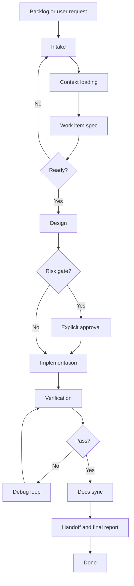
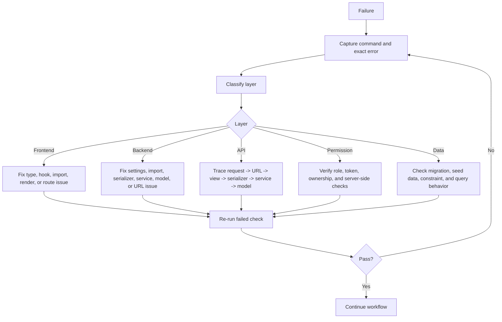

# Iteration Workflow

This document defines how Sunshine Reading should plan, implement, verify, and hand off each project iteration.

本文件定义阳光阅读后续每一轮迭代如何进入、拆分、实现、验证与交接。

## 1. Purpose

The workflow has four goals:

1. Keep every iteration small enough to review and verify.
2. Preserve existing route, data, permission, and API response contracts.
3. Make tests and documentation part of the same iteration, not follow-up work.
4. Leave enough context for another developer or AI session to continue safely.

This document is the practical execution workflow. It complements:

| Document | Role |
| --- | --- |
| `AGENTS.md` | Mandatory AI workflow and boundary rules. |
| `.cursor/rules/00-project-overview.mdc` to `.cursor/rules/07-ai-working-mode.mdc` | Project, frontend, backend, API, database, UI, security, and AI execution rules. |
| `docs/spec-coding/01-current-state.md` | Current implemented system state. |
| `docs/spec-coding/03-roadmap.md` | Product and engineering roadmap. |
| `docs/spec-coding/04-development-flow.md` | General development flow diagrams. |
| `docs/spec-coding/05-testing-plan.md` | Verification commands and scenario matrix. |
| `docs/spec-coding/06-api-data-contract.md` | Actual current API and data contract. |
| `docs/spec-coding/08-context-handoff-template.md` | Handoff format for long-running work. |

Important contract note:

- The current implementation uses `/api/` routes and `{ "code": 0, "message": "success", "data": ... }`.
- `.cursor/rules/03-api-contract.mdc` still describes an older `/api/v1` + `request_id` plan.
- For normal development, preserve the actual implemented contract recorded in `06-api-data-contract.md`.
- Any migration toward a different API envelope or route prefix must be its own approved migration task.

## 2. Iteration Unit

One iteration should normally fit into 0.5 to 2 working days.

Each iteration must have exactly one primary objective, for example:

- one user-facing feature slice,
- one backend capability,
- one frontend page or workflow,
- one bug fix,
- one test or infrastructure improvement,
- one documentation or design update.

Do not combine unrelated high-risk changes in the same iteration. Examples to avoid:

- new models + multiple pages + permission redesign + UI restyle,
- payment or entitlement work mixed with ordinary UI polish,
- API envelope migration mixed with feature development,
- broad encoding cleanup mixed with business logic changes,
- automation scripts that also rewrite application code.

Large features, such as "generate short videos from novel/story/article content", must start as a design/RFC iteration before implementation. The first implementation iteration should then cover only one thin vertical slice, such as "text input -> AI-generated storyboard draft".

## 3. Workflow Overview



## 4. Roles And Responsibilities

| Role | Responsibility |
| --- | --- |
| Requester | Defines the problem, priority, acceptance criteria, and forbidden scope. |
| Implementer | Reads rules/docs, scopes the change, implements minimal changes, runs verification, and reports risks. |
| Reviewer | Checks behavior, permission boundaries, API compatibility, test coverage, and documentation updates. |
| Operator/Admin | Confirms admin-facing behavior, audit requirements, data safety, and operational fallback. |

For solo or AI-assisted work, the implementer must still simulate the reviewer role before marking the iteration done.

## 5. Intake

Every iteration starts by clarifying:

| Question | Required |
| --- | --- |
| What problem does this solve? | Yes |
| Which role is affected: reader, author, reviewer, admin, public visitor, or operator? | Yes |
| Is this docs-only, frontend-only, backend-only, full-stack, test, or infrastructure work? | Yes |
| Which files, apps, or domains are allowed to change? | Yes |
| Which files, apps, or domains must not change? | Yes |
| Does it affect models, migrations, routes, API fields, permissions, or response envelopes? | Yes |
| What is the smallest acceptable deliverable? | Yes |
| What verification commands or manual checks will prove completion? | Yes |

If these answers are unclear, the iteration should stay in design or clarification. Implementation should not start.

## 6. Context Loading

Before editing files, load context in this order:

1. `AGENTS.md`.
2. `.cursor/rules/00-project-overview.mdc` through `.cursor/rules/07-ai-working-mode.mdc`.
3. One matching checklist from `docs/ai-skills`.
4. `docs/spec-coding/01-current-state.md`.
5. `docs/spec-coding/06-api-data-contract.md` if API, data, roles, or permissions may change.
6. `docs/spec-coding/05-testing-plan.md` if tests or verification commands may change.
7. Current code for the target domain.

Skill selection guide:

| Task type | Preferred skill file |
| --- | --- |
| Reader or chapter reading feature | `docs/ai-skills/create-reading-feature.md` |
| Backend API | `docs/ai-skills/create-backend-api.md` |
| Django model/data change | `docs/ai-skills/create-django-model.md` |
| Frontend page | `docs/ai-skills/create-frontend-page.md` |
| Author workspace | `docs/ai-skills/create-author-feature.md` |
| Admin/operations | `docs/ai-skills/create-admin-feature.md` |
| Debug frontend | `docs/ai-skills/debug-frontend.md` |
| Debug backend | `docs/ai-skills/debug-backend.md` |
| Refactor or workflow restructuring | `docs/ai-skills/refactor-module.md` |

## 7. Work Item Template

Use this template before implementation when a task is larger than a one-line fix.

```markdown
## Iteration Work Item

Title:
Priority: P0 / P1 / P2 / P3
Type: docs / feature / bugfix / refactor / test / infrastructure
Primary role affected:
Target domain:

### Goal

### Non-goals

### Allowed Scope

### Forbidden Scope

### Current Behavior

### Desired Behavior

### Backend Design

- Models:
- Selectors:
- Services:
- Serializers:
- Views:
- URLs:
- Permissions:
- Migration:
- Audit log:

### Frontend Design

- Routes:
- Components:
- API wrappers:
- State handling:
- Loading/empty/error/forbidden:
- Mobile behavior:

### API Contract

- Endpoints:
- Request fields:
- Response fields:
- Pagination:
- Error cases:

### Acceptance Criteria

- [ ]

### Verification

- Backend:
- Frontend:
- Manual:

### Documentation Updates

- [ ]

### Rollback Or Failure Handling
```

## 8. Definition Of Ready

A work item is ready for implementation only when:

- Goal and non-goals are explicit.
- Allowed and forbidden scope are explicit.
- User role and permission impact are known.
- API route, method, request, response, and error behavior are known when applicable.
- Model and migration impact are known when applicable.
- UI states are known when applicable.
- Verification commands and manual checks are listed.
- Rollback or failure handling is understood for risky changes.

## 9. Design Rules

### Backend

Follow the existing Django app layering:

```text
views -> serializers/services/selectors -> models
```

Rules:

- Views should stay thin.
- Serializers validate input and shape output.
- Selectors own query/read patterns.
- Services own write/business behavior.
- Permission checks must be server-side, not frontend-only.
- Model changes require migrations and rollback risk notes.
- Admin, reviewer, author, and reader boundaries must be tested or manually verified.

### Frontend

Follow the existing Next.js structure under `apps/web`:

```text
app -> feature/page logic -> shared components/lib
```

Rules:

- Pages own data loading and workflow state.
- Shared visual components should not make hidden API calls.
- API calls should use the existing request wrapper.
- Protected pages need login/forbidden handling.
- Every new page or major workflow needs loading, empty, error, and forbidden states.
- Mobile behavior must be considered for reader and admin workflows.

### API And Data

Rules:

- Preserve `/api/` routes unless a migration task says otherwise.
- Preserve `{ code, message, data }` response envelope.
- Preserve current pagination shape unless a migration task says otherwise.
- New response fields should be additive when possible.
- Sensitive fields such as password, token, phone, and email must not leak.
- Create/update/delete/publish/review/admin actions should create audit logs when they affect business state.

## 10. Risk Gates

Stop and ask for explicit approval before doing any of these:

- Changing the API envelope or route prefix.
- Renaming or deleting an existing route.
- Removing or renaming database fields.
- Running destructive migrations or data cleanup.
- Changing auth/token storage strategy.
- Adding payment, entitlement, wallet, or membership behavior.
- Adding production deployment or CI behavior that changes environments.
- Introducing a new external AI/media provider with persisted keys.
- Storing user-provided API keys or sensitive provider secrets.
- Running scaffold/init commands.
- Broadly rewriting files outside the requested scope.

## 11. Implementation Rules

During implementation:

1. Keep changes limited to the target work item.
2. Prefer existing patterns over new abstractions.
3. Add abstractions only when they reduce real duplication or complexity.
4. Preserve existing naming, response envelope, route shape, and permission model.
5. Add or update tests when behavior, permissions, models, or shared contracts change.
6. Avoid opportunistic refactors.
7. Do not hide failed checks in the final report.

## 12. Debug Loop

When verification fails:



The debug loop should fix the smallest cause of failure. It should not expand into a broad rewrite unless the work item is explicitly re-scoped.

## 13. Verification Gates

### Docs-only

Required:

```powershell
Get-ChildItem docs\spec-coding
```

Recommended:

- Re-read changed Markdown.
- Check headings, tables, code blocks, and Mermaid blocks.
- Confirm no code/API behavior was changed.

### Backend-only

Required:

```powershell
cd services/api
.\.venv\Scripts\python.exe manage.py check
```

If no model change is expected:

```powershell
.\.venv\Scripts\python.exe manage.py makemigrations --check --dry-run
```

If models changed:

```powershell
.\.venv\Scripts\python.exe manage.py makemigrations
.\.venv\Scripts\python.exe manage.py migrate
```

If API behavior changed:

```powershell
.\.venv\Scripts\python.exe manage.py test common --noinput
```

Add domain-specific tests when the change is not covered by `common`.

### Frontend-only

Required:

```powershell
cd apps/web
npx.cmd tsc --noEmit --incremental false
npm.cmd run lint
```

If routes, layouts, build-time code, or shared UI changed:

```powershell
npm.cmd run build
```

Manual checks:

- Open affected page.
- Confirm loading, empty, error, and forbidden states when applicable.
- Check mobile layout for reader and admin-heavy workflows.

### Full-stack

Required:

- Backend gates.
- Frontend gates.
- Manual browser/API flow.
- Role boundary check.
- API envelope check.
- Documentation update.

### AI, Media, Or Long-Running Jobs

Required design checks before implementation:

- Provider boundary: which service is called and where credentials live.
- Cost and quota behavior.
- Async job lifecycle.
- Retry and failure states.
- Storage location and cleanup policy.
- Content safety and copyright/moderation policy.
- Audit and usage logs.

For a future short-video generation feature, the first accepted implementation should verify a narrow path before generating real video, for example:

```text
input text -> structured story analysis -> storyboard scenes -> saved project draft
```

Only after that path is stable should later iterations add image generation, TTS, subtitles, FFmpeg rendering, download, and provider-specific video generation.

## 14. Definition Of Done

An iteration is done only when:

- The primary objective is met.
- No forbidden scope was changed.
- API and permission compatibility are preserved or explicitly migrated.
- Required tests/checks were run, or skipped with a clear reason.
- New failures are fixed or documented as residual risk.
- Related docs are updated.
- Final report includes changed files, verification results, and remaining risks.

## 15. Documentation Sync Matrix

Update docs in the same iteration as the code change:

| Change type | Documents to update |
| --- | --- |
| Current feature/page/API/model status changed | `01-current-state.md` |
| Feature behavior or product requirement changed | `02-feature-spec.md` |
| Priority, phase, or backlog changed | `03-roadmap.md` |
| Development process changed | `04-development-flow.md` or this file |
| Test command, test case, or verification rule changed | `05-testing-plan.md` |
| API route, field, permission, model, or contract changed | `06-api-data-contract.md` |
| Handoff format changed | `08-context-handoff-template.md` |

For meaningful code iterations, update at least one relevant `docs/spec-coding` document unless the task is a tiny internal fix with no behavior or workflow impact.

## 16. Backlog Triage

Use this priority model:

| Priority | Meaning | Examples |
| --- | --- | --- |
| P0 | Blocks development correctness or basic usage. | Broken build, broken login, data loss risk, API envelope regression. |
| P1 | Core product or operations capability. | Admin management, review workflow, author feedback, audit logs. |
| P2 | Important improvement with manageable risk. | Reader UX polish, comment replies, author productivity, AI chat polish. |
| P3 | Discovery or engagement expansion. | Search suggestions, recommendation, notifications. |
| P4 | High-risk business/platform expansion. | Payment, membership, production deployment automation. |

Selection rule:

1. Finish P0 stability before large feature work.
2. Prefer single-item operations before bulk operations.
3. Prefer auditability before business-critical admin actions.
4. Prefer design/RFC before AI, media, payment, security, or data lifecycle features.

## 17. Recommended Current Lanes

Based on the current project state, future iterations should usually come from these lanes:

| Lane | Why |
| --- | --- |
| Stability | Encoding cleanup, API docs, frontend smoke/E2E tests, backend domain tests. |
| Operations | Remaining admin audit surfaces, bulk moderation, report queue. |
| Author productivity | Server-side drafts, cover upload, bulk chapter import, author stats. |
| Reader experience | Reader settings polish, table of contents drawer, comment replies, search improvements. |
| AI/media design | AI chat streaming/RAG, novel-to-short-video RFC, cost/usage limits. |
| Platform | Environment separation, CI, deployment docs, backup/restore. |

## 18. Iteration Log Template

Append completed meaningful iterations in this format when useful:

```markdown
### YYYY-MM-DD - Iteration Title

Completed:

- 

Verified:

- 

Changed docs:

- 

Remaining:

- 

Next recommendation:

- 
```

Do not use the iteration log as a replacement for updating `01-current-state.md`, `03-roadmap.md`, `05-testing-plan.md`, or `06-api-data-contract.md` when those documents are affected.

## 19. Final Report Format

Each completed iteration should end with:

```text
Changed files:
- ...

What changed:
- ...

Verification:
- ...

Risks / remaining work:
- ...

Next recommended iteration:
- ...
```

If checks could not be run, say why and list the residual risk.
