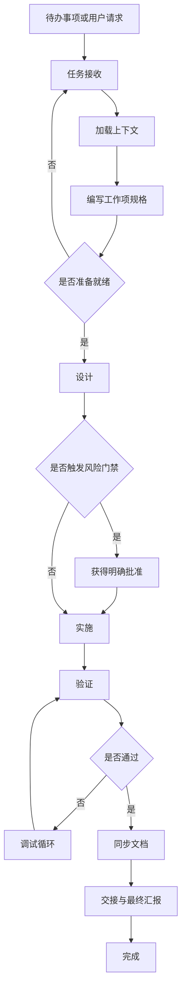
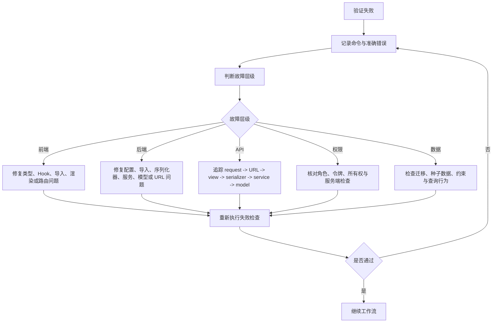

# 迭代工作流

本文档定义 Sunshine Reading 每轮项目迭代的规划、实施、验证与交接方式。

## 1. 目的

本工作流有四个目标：

1. 将每轮迭代控制在可评审、可验证的范围内。
2. 保持现有路由、数据、权限和 API 响应契约稳定。
3. 将测试与文档更新纳入同一轮迭代，而不是后续补做。
4. 为其他开发者或后续 AI 会话留下足够的安全接续信息。

本文档是实际执行入口，并与以下文档配合使用：

| 文档 | 作用 |
| --- | --- |
| `AGENTS.md` | AI 强制工作流与边界规则。 |
| `.cursor/rules/00-project-overview.mdc` 到 `.cursor/rules/07-ai-working-mode.mdc` | 项目、前端、后端、API、数据库、UI、安全与 AI 执行规则。 |
| `docs/spec-coding/01-current-state.md` | 当前已实现系统状态。 |
| `docs/spec-coding/03-roadmap.md` | 产品与工程路线图。 |
| `docs/spec-coding/04-development-flow.md` | 通用开发流程图。 |
| `docs/spec-coding/05-testing-plan.md` | 验证命令与场景矩阵。 |
| `docs/spec-coding/06-api-data-contract.md` | 当前实际 API 与数据契约。 |
| `docs/spec-coding/08-context-handoff-template.md` | 长任务的交接格式。 |

重要契约说明：

- 当前实现使用 `/api/` 路由和 `{ "code": 0, "message": "success", "data": ... }`。
- `.cursor/rules/03-api-contract.mdc` 仍描述较早的 `/api/v1` 与 `request_id` 规划。
- 日常开发必须以 `06-api-data-contract.md` 记录的实际契约为准。
- 迁移到其他 API 封装或路由前缀时，必须建立独立且经过批准的迁移任务。

## 2. 迭代单位

一轮迭代通常应控制在 0.5 到 2 个工作日内，并且只能有一个主要目标，例如：

- 一个面向用户的功能切片。
- 一项后端能力。
- 一个前端页面或工作流。
- 一个缺陷修复。
- 一项测试或基础设施改进。
- 一次文档或设计更新。

不得在同一轮迭代中混合无关的高风险变更。应避免：

- 新模型、多个页面、权限重构和 UI 改版同时进行。
- 支付或权益功能与普通 UI 优化混合。
- API 响应封装迁移与功能开发混合。
- 大范围编码清理与业务逻辑修改混合。
- 自动化脚本同时重写应用代码。

“根据小说、故事或文章生成短视频”这类大型功能，必须先进行设计或 RFC 迭代。第一轮实现只能覆盖一个窄的纵向切片，例如“文本输入 -> AI 分镜草稿”。

## 3. 工作流总览



## 4. 角色与职责

| 角色 | 职责 |
| --- | --- |
| 需求方 | 定义问题、优先级、验收标准与禁止范围。 |
| 实施者 | 阅读规则与文档、控制变更范围、实施最小修改、执行验证并汇报风险。 |
| 评审者 | 检查行为、权限边界、API 兼容性、测试覆盖和文档更新。 |
| 运营或管理员 | 确认管理端行为、审计要求、数据安全与运行兜底。 |

个人或 AI 辅助开发时，实施者在标记完成前仍必须模拟评审者角色执行复核。

## 5. 任务接收

每轮迭代开始时必须明确：

| 问题 | 是否必填 |
| --- | --- |
| 本任务解决什么问题？ | 是 |
| 影响哪个角色：读者、作者、审核员、管理员、公开访客或运营人员？ | 是 |
| 属于纯文档、纯前端、纯后端、全栈、测试还是基础设施任务？ | 是 |
| 允许修改哪些文件、应用或领域？ | 是 |
| 禁止修改哪些文件、应用或领域？ | 是 |
| 是否影响模型、迁移、路由、API 字段、权限或响应封装？ | 是 |
| 最小可接受交付物是什么？ | 是 |
| 哪些命令或手工检查可以证明完成？ | 是 |

如果这些问题没有明确答案，任务应停留在设计或澄清阶段，不得开始实施。

## 6. 加载上下文

修改文件前按以下顺序加载上下文：

1. `AGENTS.md`。
2. `.cursor/rules/00-project-overview.mdc` 到 `.cursor/rules/07-ai-working-mode.mdc`。
3. 从 `docs/ai-skills` 选择一个匹配清单。
4. `docs/spec-coding/01-current-state.md`。
5. API、数据、角色或权限可能变化时阅读 `docs/spec-coding/06-api-data-contract.md`。
6. 测试或验证命令可能变化时阅读 `docs/spec-coding/05-testing-plan.md`。
7. 目标领域的当前代码。

技能选择指南：

| 任务类型 | 首选技能文件 |
| --- | --- |
| 读者或章节阅读功能 | `docs/ai-skills/create-reading-feature.md` |
| 后端 API | `docs/ai-skills/create-backend-api.md` |
| Django 模型或数据变更 | `docs/ai-skills/create-django-model.md` |
| 前端页面 | `docs/ai-skills/create-frontend-page.md` |
| 作者工作台 | `docs/ai-skills/create-author-feature.md` |
| 管理或运营功能 | `docs/ai-skills/create-admin-feature.md` |
| 前端排障 | `docs/ai-skills/debug-frontend.md` |
| 后端排障 | `docs/ai-skills/debug-backend.md` |
| 重构或工作流调整 | `docs/ai-skills/refactor-module.md` |

## 7. 工作项模板

任务大于一行修复时，实施前使用以下模板：

```markdown
## 迭代工作项

标题：
优先级：P0 / P1 / P2 / P3
类型：文档 / 功能 / 缺陷修复 / 重构 / 测试 / 基础设施
主要影响角色：
目标领域：

### 目标

### 非目标

### 允许范围

### 禁止范围

### 当前行为

### 期望行为

### 后端设计

- 模型：
- 选择器：
- 服务：
- 序列化器：
- 视图：
- URL：
- 权限：
- 迁移：
- 审计日志：

### 前端设计

- 路由：
- 组件：
- API 封装：
- 状态处理：
- 加载、空态、错误、无权限：
- 移动端行为：

### API 契约

- 接口：
- 请求字段：
- 响应字段：
- 分页：
- 错误情况：

### 验收标准

- [ ]

### 验证

- 后端：
- 前端：
- 手工：

### 文档更新

- [ ]

### 回滚或失败处理
```

## 8. 准入定义

工作项只有满足以下条件才可进入实施：

- 目标与非目标明确。
- 允许范围与禁止范围明确。
- 已知用户角色与权限影响。
- 适用时已知 API 路由、方法、请求、响应与错误行为。
- 适用时已知模型与迁移影响。
- 适用时已知 UI 状态。
- 已列出验证命令和手工检查。
- 高风险变更的回滚或失败处理已明确。

## 9. 设计规则

### 后端

遵循现有 Django 应用分层：

```text
views -> serializers/services/selectors -> models
```

- 视图保持精简。
- 序列化器负责输入校验与输出结构。
- 选择器负责查询与读取模式。
- 服务负责写操作与业务行为。
- 权限检查必须在服务端执行，不能只依赖前端。
- 模型变更必须包含迁移与回滚风险说明。
- 管理员、审核员、作者与读者边界必须经过测试或手工验证。

### 前端

遵循 `apps/web` 下的现有 Next.js 结构：

```text
app -> feature/page logic -> shared components/lib
```

- 页面负责数据加载与工作流状态。
- 共享视觉组件不得执行隐藏的 API 调用。
- API 调用应使用现有请求封装。
- 受保护页面必须处理登录与无权限状态。
- 每个新页面或主要工作流必须处理加载、空态、错误与无权限状态。
- 读者与管理端工作流必须考虑移动端行为。

### API 与数据

- 除非独立迁移任务另有说明，否则保留 `/api/` 路由。
- 保留 `{ code, message, data }` 响应封装。
- 除非独立迁移任务另有说明，否则保留当前分页结构。
- 新响应字段应尽量采用向后兼容的增量方式添加。
- 不得泄露密码、令牌、手机号和邮箱等敏感字段。
- 创建、更新、删除、发布、审核和管理操作影响业务状态时应记录审计日志。

## 10. 风险门禁

执行以下操作前必须停止并请求明确批准：

- 修改 API 响应封装或路由前缀。
- 重命名或删除现有路由。
- 删除或重命名数据库字段。
- 执行破坏性迁移或数据清理。
- 修改身份认证或令牌存储策略。
- 增加支付、权益、钱包或会员行为。
- 增加会改变环境的生产部署或 CI 行为。
- 引入会持久化密钥的新外部 AI 或媒体服务商。
- 存储用户提供的 API Key 或敏感服务商密钥。
- 执行脚手架或初始化命令。
- 大范围重写请求范围之外的文件。

## 11. 实施规则

实施期间：

1. 将变更限制在目标工作项内。
2. 优先复用现有模式，不随意引入新抽象。
3. 只有在确实减少重复或复杂度时才增加抽象。
4. 保持现有命名、响应封装、路由结构与权限模型。
5. 行为、权限、模型或共享契约变化时增加或更新测试。
6. 禁止机会式重构。
7. 最终汇报不得隐藏失败检查。
8. 指导文档、规则、技能和提示模板的说明文字必须使用简体中文。

## 12. 调试循环

验证失败时：



调试循环应修复最小故障原因。除非工作项明确重新划定范围，否则不得扩展为大范围重写。

## 13. 验证门禁

### 纯文档任务

必须执行：

```powershell
Get-ChildItem docs\spec-coding
```

建议执行：

- 重新阅读变更后的 Markdown。
- 检查标题、表格、代码块和 Mermaid 图表。
- 确认没有改变代码或 API 行为。
- 确认提示类文档说明文字使用简体中文。

### 纯后端任务

必须执行：

```powershell
cd services/api
.\.venv\Scripts\python.exe manage.py check
```

不应发生模型变化时执行：

```powershell
.\.venv\Scripts\python.exe manage.py makemigrations --check --dry-run
```

模型发生变化时执行：

```powershell
.\.venv\Scripts\python.exe manage.py makemigrations
.\.venv\Scripts\python.exe manage.py migrate
```

API 行为发生变化时执行：

```powershell
.\.venv\Scripts\python.exe manage.py test common --noinput
```

如果 `common` 未覆盖该变更，应增加并执行领域测试。

### 纯前端任务

必须执行：

```powershell
cd apps/web
npx.cmd tsc --noEmit --incremental false
npm.cmd run lint
```

路由、布局、构建时代码或共享 UI 发生变化时执行：

```powershell
npm.cmd run build
```

手工检查：

- 打开受影响页面。
- 适用时确认加载、空态、错误与无权限状态。
- 检查读者与管理密集页面的移动端布局。

### 全栈任务

必须执行：

- 后端门禁。
- 前端门禁。
- 手工浏览器或 API 流程。
- 角色边界检查。
- API 响应封装检查。
- 文档更新。

### AI、媒体或长时间任务

实施前必须检查：

- 服务商边界：调用哪个服务，凭据保存在何处。
- 成本与配额行为。
- 异步任务生命周期。
- 重试与失败状态。
- 存储位置与清理策略。
- 内容安全、版权或审核策略。
- 审计与用量日志。

短视频生成功能的首个可接受实现应先验证窄链路：

```text
输入文本 -> 结构化故事分析 -> 分镜场景 -> 保存项目草稿
```

该链路稳定后，后续迭代再增加图片生成、TTS、字幕、FFmpeg 渲染、下载与服务商专用视频生成。

## 14. 完成定义

只有满足以下条件，迭代才可标记为完成：

- 主要目标已实现。
- 未修改禁止范围。
- API 与权限兼容性已保持，或已通过独立迁移明确处理。
- 已执行必需测试与检查；未执行项有明确原因。
- 新故障已修复，或已记录为剩余风险。
- 相关文档已更新。
- 最终汇报包含变更文件、验证结果和剩余风险。

## 15. 文档同步矩阵

代码变更与文档必须在同一轮迭代中更新：

| 变更类型 | 需要更新的文档 |
| --- | --- |
| 当前功能、页面、API 或模型状态变化 | `01-current-state.md` |
| 功能行为或产品要求变化 | `02-feature-spec.md` |
| 优先级、阶段或待办变化 | `03-roadmap.md` |
| 开发流程变化 | `04-development-flow.md` 或本文档 |
| 测试命令、测试用例或验证规则变化 | `05-testing-plan.md` |
| API 路由、字段、权限、模型或契约变化 | `06-api-data-contract.md` |
| 交接格式变化 | `08-context-handoff-template.md` |

有实际意义的代码迭代应至少更新一份相关 `docs/spec-coding` 文档，微小且不改变行为或流程的内部修复除外。

## 16. 待办优先级

| 优先级 | 含义 | 示例 |
| --- | --- | --- |
| P0 | 阻塞开发正确性或基本使用。 | 构建失败、登录失败、数据丢失风险、API 封装回归。 |
| P1 | 核心产品或运营能力。 | 管理功能、审核流程、作者反馈、审计日志。 |
| P2 | 风险可控的重要改进。 | 阅读体验优化、评论回复、作者效率、AI 对话优化。 |
| P3 | 发现与互动扩展。 | 搜索建议、推荐、通知。 |
| P4 | 高风险业务或平台扩展。 | 支付、会员、生产部署自动化。 |

选择规则：

1. 进行大型功能前先完成 P0 稳定性问题。
2. 批量操作前优先完成单项操作。
3. 关键管理操作前优先建立可审计性。
4. AI、媒体、支付、安全或数据生命周期功能必须先完成设计或 RFC。

## 17. 当前建议方向

后续迭代通常应从以下方向选择：

| 方向 | 原因 |
| --- | --- |
| 稳定性 | 编码清理、API 文档、前端冒烟或 E2E 测试、后端领域测试。 |
| 运营 | 剩余管理审计面、批量审核、举报队列。 |
| 作者效率 | 服务端草稿、封面上传、章节批量导入、作者统计。 |
| 读者体验 | 阅读设置优化、目录抽屉、评论回复、搜索改进。 |
| AI 与媒体设计 | AI 对话流式输出或 RAG、小说转短视频 RFC、成本与用量限制。 |
| 平台 | 环境隔离、CI、部署文档、备份与恢复。 |

## 18. 迭代日志模板

有需要时，按以下格式追加已完成的重要迭代：

```markdown
### YYYY-MM-DD - 迭代标题

已完成：

-

已验证：

-

已变更文档：

-

剩余事项：

-

下一步建议：

-
```

迭代日志不能替代对 `01-current-state.md`、`03-roadmap.md`、`05-testing-plan.md` 或 `06-api-data-contract.md` 的必要更新。

## 19. 最终汇报格式

每轮完成的迭代应使用以下格式结束：

```text
变更文件：
- ……

变更内容：
- ……

验证结果：
- ……

风险与剩余工作：
- ……

下一轮建议：
- ……
```

无法执行检查时，必须说明原因并列出剩余风险。
