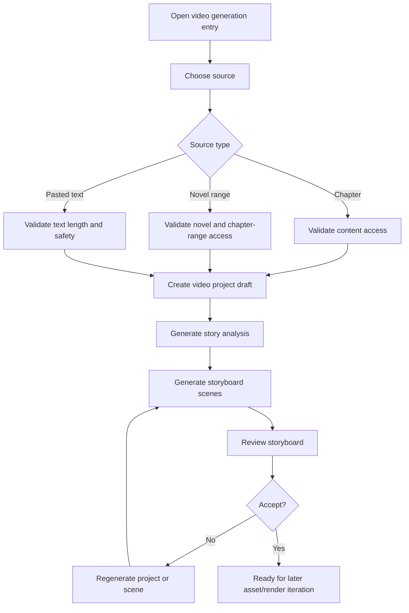
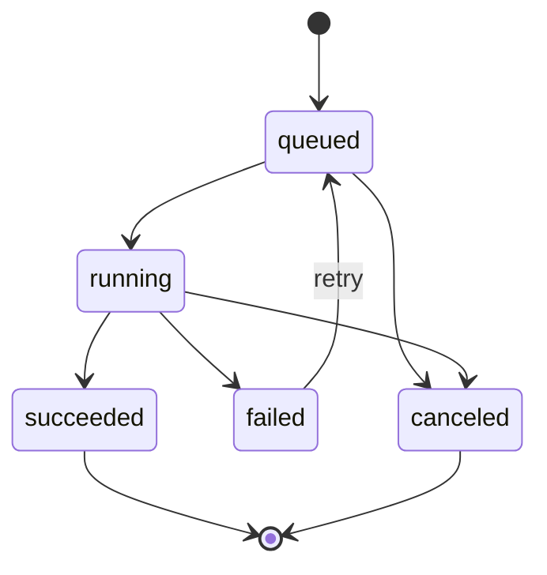

# Short Video Generation RFC

状态：草案；迭代 7B.2d 人工视觉复核与局部重拍第一阶段已完成

Owner domain: AI/media design

Primary roles: author, reader, admin

Related workflow: `09-iteration-workflow.md`

Related skill: `docs/ai-skills/create-reading-feature.md`

## 1. Goal

Design a feature that can generate a short vertical video plan from novel content, a story, or an article.

The first implementation should not try to generate a full video immediately. The safest MVP is:

```text
input text or chapter -> AI story analysis -> storyboard scenes -> saved video project draft
```

Only after this path is stable should later iterations add image generation, voice generation, subtitles, FFmpeg rendering, download, and direct video-generation providers.

## 2. Non-Goals

本 RFC 同时记录分阶段设计与当前实现状态，不代表所有规划能力均已完成。

This RFC does not:

- Initialize a new framework or app.
- Change the API envelope.
- Change existing routes.
- Store user-supplied provider API keys.
- 接入直接文生视频供应商；当前仅接入可控的分镜图片和旁白语音供应商。
- Add payment, membership, publishing, or distribution to external short-video platforms.
- Decide production object storage or CDN configuration.
- Replace the existing AI chat feature.

## 3. Product Positioning

The feature should support two primary scenarios:

| Scenario | User | Value |
| --- | --- | --- |
| Author promotion | Author | Turn a chapter or synopsis into a short promotional video draft. |
| Reader sharing | Reader | Turn a favorite public chapter excerpt or pasted story into a shareable story video draft. |

Admin needs visibility into jobs, provider errors, usage, and unsafe content flags.

## 4. Input Sources

Initial sources:

1. Existing public novel chapter.
2. Author-owned novel/chapter draft or approved content.
3. Pasted story/article text.

Recommended first limits:

| Field | Limit |
| --- | --- |
| Input text length | 500 to 3000 Chinese characters for MVP. |
| Novel chapter range | 1 to 10 chapter numbers; balanced snapshot capped at 6000 characters. |
| Video duration target | 30 to 90 seconds. |
| Scene count | 4 to 8 scenes. |
| Scene duration | 4 to 12 seconds each. |
| Aspect ratio | 9:16 vertical. |
| Language | Chinese first; English can be later. |

Rejected inputs:

- Empty or too-short text.
- Unsafe HTML/script payloads.
- Text the user cannot access.
- Chapter content hidden by permission/status rules.
- Provider API key or secret submitted as part of content.

## 5. MVP Output

The first shippable MVP should produce:

- Project title.
- Source summary.
- Target audience.
- Narrative hook.
- Scene list.
- Per-scene visual prompt.
- Per-scene narration.
- Per-scene subtitle.
- Per-scene duration.
- Style preset.
- Status and failure reason.

It should not produce image/audio/video files in the first implementation slice.

## 6. User Flow



## 7. Future Full Generation Flow

Later iterations can extend the pipeline:

```text
storyboard -> image assets -> narration audio -> subtitles -> background music -> FFmpeg render -> MP4 download
```

Direct text-to-video providers should be a later optional rendering path, not the base MVP.

Reason:

- Storyboard generation is cheaper and easier to verify.
- Image + TTS + subtitles + FFmpeg is more controllable than direct text-to-video.
- Direct video-generation providers are slower, more expensive, and harder to debug.

## 8. Permission Model

| Action | Public | Reader | Author | Reviewer | Admin/staff/superuser |
| --- | --- | --- | --- | --- | --- |
| Create from pasted text | No | Own | Own | Own if logged in | All |
| Create from public approved chapter | No | Own | Own | Own if logged in | All |
| Create from author draft/rejected chapter | No | No | Own content only | No | All |
| View project | No | Own | Own | Own if creator | All |
| Regenerate project/scene | No | Own | Own | Own if creator | All |
| Render final video | No | Own, if enabled | Own, if enabled | Own, if enabled | All |
| Inspect job/provider logs | No | No | No | No | All |
| Delete project | No | Own | Own | Own if creator | All |

Rules:

- Backend is the source of truth for ownership and content access.
- Frontend entry points are UX only and do not replace server-side checks.
- Pasted text projects belong to the creating user.
- Chapter projects must record source identity and source snapshot metadata.
- Admin can inspect or disable unsafe projects.

## 9. Proposed Domain Model

Future app name: `video_generation`

The name is intentionally English and domain-specific.

### `video_project`

Represents a user-created generation project.

Fields:

- `id`
- `owner_id`
- `source_type`: `chapter`, `novel`, `text`
- `source_novel_id`
- `source_chapter_id`
- `source_title`
- `source_excerpt_hash`
- `input_text`
- `title`
- `summary`
- `style_preset`
- `duration_target`
- `aspect_ratio`
- `status`: `draft`, `analyzing`, `storyboard_ready`, `asset_generating`, `rendering`, `completed`, `failed`, `canceled`
- `failure_reason`
- `created_at`
- `updated_at`
- `deleted_at`

Notes:

- `input_text` may be large and should not be returned in list APIs.
- If copyright/storage policy becomes stricter, store a snapshot excerpt instead of full chapter text for chapter-sourced projects.
- Add indexes on `owner_id`, `status`, `source_type`, and `created_at`.

### `video_scene`

Represents one storyboard scene.

Fields:

- `id`
- `project_id`
- `scene_no`
- `title`
- `visual_prompt`
- `narration_text`
- `subtitle_text`
- `duration_seconds`
- `camera_direction`
- `mood`
- `status`: `draft`, `ready`, `failed`
- `failure_reason`
- `created_at`
- `updated_at`

Constraints:

- Unique `project_id + scene_no`.
- Scene duration must be positive.

### `video_asset`

Represents generated or uploaded media assets.

Fields:

- `id`
- `project_id`
- `scene_id`
- `asset_type`: `image`, `video`, `audio`, `subtitle`, `final_video`
- `storage_path`
- `file_name`
- `mime_type`
- `file_size`
- `provider`
- `provider_asset_id`
- `status`: `queued`, `running`, `ready`, `stale`, `failed`
- `metadata`
- `failure_reason`
- `created_at`
- `updated_at`

当前实现说明：

- 迭代 5A 已支持项目级 SRT 字幕素材；迭代 5B 已支持逐镜图片和独立旁白；迭代 5C 已支持逐镜视频；迭代 6 已支持项目级最终 MP4。
- 字幕与最终成片不关联单个场景；图像、视频和音频素材必须关联场景。
- 修改字幕文本、旁白、标题或时长后，现有字幕自动转为 `stale`，下载被拒绝，直至重新生成。
- 修改画面提示词、运镜或氛围时，对应分镜图片转为 `stale`；修改旁白、字幕或标题时，对应音频转为 `stale`。
- 逐镜视频元数据记录是否使用同分镜静态图首帧、引用图片 ID 与摘要或回退原因，不持久化 Base64 图片正文。
- 独立旁白元数据保存本地 WAV 波形质检报告、可选 ASR 文本一致性报告和人工试听结论；波形报告未通过时素材不得进入 `ready`，波形通过但语义未确认的旁白不得进入成片。
- 图片、逐镜视频、音频、字幕和最终成片均写入被 Git 忽略的 `media/`，只通过所有者/管理员鉴权接口访问。
- 修改任一影响画面、旁白、字幕或时长的分镜字段，或重新生成相关素材后，已有最终成片自动转为 `stale`。

### `video_render_job`

Represents a long-running generation or render job.

Fields:

- `id`
- `project_id`
- `job_type`: `analysis`, `storyboard`, `image`, `tts`, `subtitle`, `render`
- `status`: `queued`, `running`, `succeeded`, `failed`, `canceled`
- `progress`
- `attempt_count`
- `error_code`
- `error_message`
- `started_at`
- `finished_at`
- `created_at`
- `updated_at`

### `video_usage_log`

Records provider usage and safety events.

Fields:

- `id`
- `project_id`
- `user_id`
- `provider`
- `operation`
- `model`
- `input_units`
- `output_units`
- `cost_estimate`
- `status`
- `error_code`
- `created_at`

Sensitive fields such as provider tokens, API keys, phone, and email must not be stored.

## 10. API Draft

Use the current implemented API convention:

- Base route: `/api/`
- Success envelope: `{ "code": 0, "message": "success", "data": ... }`
- Pagination: `{ count, next, previous, results }` inside `data`

Future endpoint draft:

| Method | Endpoint | Permission | Purpose |
| --- | --- | --- | --- |
| `POST` | `/api/video-projects/` | logged-in user | Create a project from text or source content. |
| `GET` | `/api/video-source-chapters/` | logged-in user | List public or owned chapters available as sources. |
| `GET` | `/api/video-source-novels/` | logged-in user | List public or owned novels with accessible chapter bounds. |
| `POST` | `/api/video-projects/from-chapter/` | logged-in user | Create a project from an accessible chapter snapshot. |
| `POST` | `/api/video-projects/from-novel/` | logged-in user | Create a project from a bounded accessible chapter range. |
| `GET` | `/api/video-projects/` | owner/admin | List own projects. |
| `GET` | `/api/video-projects/capabilities/` | logged-in user | Inspect server-side generation availability without exposing secrets. |
| `GET` | `/api/video-projects/{id}/` | owner/admin | Get project detail and scenes. |
| `POST` | `/api/video-projects/{id}/analyze/` | owner/admin | Generate story analysis. |
| `POST` | `/api/video-projects/{id}/storyboard/` | owner/admin | Generate storyboard scenes. |
| `POST` | `/api/video-projects/{id}/storyboard/ai/` | owner/admin | Generate structured scenes with the server-configured AI provider. |
| `POST` | `/api/video-projects/{id}/storyboard/jobs/` | owner/admin | Queue a durable AI storyboard job. |
| `GET` | `/api/video-projects/{id}/storyboard/jobs/latest/` | owner/admin | Restore the latest project job state. |
| `GET` | `/api/video-generation-jobs/{id}/` | owner/admin | Poll one durable generation job. |
| `POST` | `/api/video-generation-jobs/{id}/retry/` | owner/admin | Requeue a failed job within its attempt limit. |
| `PATCH` | `/api/video-projects/{id}/scenes/{scene_id}/` | owner/admin | Edit one generated storyboard scene. |
| `POST` | `/api/video-projects/{id}/assets/subtitles/` | owner/admin | Generate or regenerate the project SRT subtitle asset. |
| `POST/GET` | `/api/video-projects/{id}/assets/images/jobs/` | owner/admin | Create or restore the latest scene image task. |
| `POST/GET` | `/api/video-projects/{id}/assets/videos/jobs/` | owner/admin | Create or restore the latest CogVideoX scene video task. |
| `POST/GET` | `/api/video-projects/{id}/assets/audio/jobs/` | owner/admin | Create or restore the latest independent narration task. |
| `POST/GET` | `/api/video-projects/{id}/render/jobs/` | owner/admin | Create or restore the latest local FFmpeg final render task. |
| `PATCH` | `/api/video-assets/{id}/visual-review/` | owner/admin | Approve one ready image/video or reject it with structured issue codes. |
| `GET` | `/api/video-assets/{id}/download/` | owner/admin | Download one ready asset through an authenticated binary response. |
| `POST` | `/api/video-scenes/{id}/regenerate/` | owner/admin | Regenerate one scene. |
| `DELETE` | `/api/video-projects/{id}/` | owner/admin | Soft-delete a project. |
| `GET` | `/api/admin/video-projects/` | admin | Admin list and moderation view. |

### `POST /api/video-projects/` Request Draft

```json
{
  "source_type": "text",
  "source_novel_id": null,
  "source_chapter_id": null,
  "input_text": "story or article text",
  "title": "optional project title",
  "style_preset": "cinematic_story",
  "duration_target": 60,
  "aspect_ratio": "9:16"
}
```

Validation:

- `source_type` is required.
- `source_type` must be one of `text`, `chapter`, or `novel`.
- `input_text` is required only for `text`.
- `source_chapter_id` is required for `chapter`.
- `duration_target` defaults to 60 and should be constrained to 30-90 for MVP.
- `aspect_ratio` defaults to `9:16`.
- User must have source access.

### Detail Response Draft

```json
{
  "code": 0,
  "message": "success",
  "data": {
    "id": 1,
    "title": "Project title",
    "source_type": "chapter",
    "source_title": "Chapter title",
    "summary": "Story summary",
    "style_preset": "cinematic_story",
    "duration_target": 60,
    "aspect_ratio": "9:16",
    "status": "storyboard_ready",
    "failure_reason": "",
    "scenes": [
      {
        "id": 10,
        "scene_no": 1,
        "title": "Opening hook",
        "visual_prompt": "Vertical cinematic scene...",
        "narration_text": "Narration line",
        "subtitle_text": "Subtitle line",
        "duration_seconds": 8,
        "mood": "suspense",
        "status": "ready"
      }
    ]
  }
}
```

## 11. Provider Strategy

Recommended phases:

| Phase | Provider dependency | Output |
| --- | --- | --- |
| Phase A | LLM only | Story analysis and storyboard. |
| Phase B | Image generation | Scene images. |
| Phase C | TTS | Narration audio. |
| Phase D | 本地 FFmpeg | 使用逐镜视频/图片、独立旁白和字幕生成 MP4；首轮已完成，不自动加入背景音乐。 |
| Phase E | CogVideoX-Flash 视频生成 | 供应商生成的逐镜 MP4。已完成第一轮。 |

Rules:

- Provider configuration should be server-side environment/config, not stored from user input.
- User-supplied keys may be acceptable for the existing AI chat feature, but long-running project generation should not persist user keys.
- Provider calls must log model, operation, success/failure, and usage, but not secrets.
- Timeouts and retry limits must be explicit.

## 12. Storage Strategy

MVP storyboard-only storage:

- Database rows only.
- No binary media files.

当前及后续媒体存储：

| Environment | Storage |
| --- | --- |
| Local development | Local media directory. |
| Staging/production | Object storage or media service. |

Rules:

- Store generated files outside source code.
- Keep storage paths in database, not raw binary blobs.
- 本地字幕、图片、逐镜视频、音频和最终成片写入被 Git 忽略的 `media/` 目录，并仅通过鉴权下载接口访问；前端响应不暴露磁盘路径。
- 下载接口返回二进制文件，是 `{ code, message, data }` JSON 封装的明确例外。
- 素材替换成功后清理旧文件；失败时清理新文件并保留上一份可用素材；项目删除时清理全部素材。
- 面向生产环境开放批量渲染前，必须补齐每用户项目数和存储总量限制。

## 13. Frontend Draft

Potential routes:

| Route | Purpose |
| --- | --- |
| `/video-projects` | User project list. |
| `/video-projects/create` | Create from text, one chapter, or a novel chapter range. |
| `/video-projects/[id]` | Storyboard review and later render progress. |
| `/author/novels/[id]/video-projects/create` | Author entry from owned novel/chapter. |
| `/admin/video-projects` | Admin moderation and troubleshooting. |

Required states:

- loading project,
- empty project list,
- invalid input,
- source permission denied,
- AI generation queued/running,
- generation failed with retry,
- storyboard ready,
- 成片素材未满足条件时禁用渲染，并明确显示缺失的画面、字幕或旁白状态；旁白缺失允许以静音降级，
- 渲染排队、运行、失败重试、完成预览与下载，
- deleted/canceled project.

Mobile behavior:

- Creation and storyboard review should be mobile-first.
- Scene cards should be scan-friendly with stable dimensions.
- Admin list can use horizontal scrolling tables.

## 14. Safety And Compliance

Required controls:

- Strip or reject unsafe HTML/script.
- Enforce source ownership and access.
- Limit input length and job frequency.
- Do not log full user input in application logs.
- Mask sensitive fields in traces.
- Record audit events for create, regenerate, render, delete, admin disable, and provider failure if business state changes.
- Add content safety flags before public sharing or platform publishing exists.
- Add copyright/product policy review before allowing video generation from content the user does not own.

Open policy decision:

- Readers may generate private drafts from public content, but public export/sharing may need stricter author/admin rules.

## 15. Async Job Lifecycle



Rules:

- Jobs should be idempotent where possible.
- Retrying a scene should not overwrite the last good scene until the new result succeeds.
- A project should expose the latest usable output even if a later regeneration fails.
- Long-running jobs should be polled by job ID.

## 16. Iteration Plan

### Iteration 1: RFC And Contract Planning

Deliverable:

- This RFC.
- Roadmap and feature-spec references.

Acceptance:

- Scope, non-goals, data model draft, API draft, permission matrix, and risks are documented.

### Iteration 2: Storyboard Data Model And Backend Skeleton

Status: first backend pass completed.

Deliverable:

- `video_generation` backend domain. Completed.
- Models for project and scene. Completed.
- Create/list/detail/delete APIs for text-sourced projects. Completed.
- Admin list/detail APIs. Completed.
- No external provider call yet. Preserved.

Acceptance:

- User can create a project from pasted text. Completed.
- Backend permissions and envelope are correct. Completed.
- Admin can inspect projects. Completed.
- Smoke tests cover create/list/detail/admin visibility/unsafe input/soft delete audit. Completed.

### Iteration 2.5: User-Facing Project Pages

Status: first frontend pass completed.

Deliverable:

- `/video-projects` list page for logged-in users. Completed.
- `/video-projects/create` pasted-text project creation page. Completed.
- `/video-projects/[id]` detail/delete page with scene placeholders. Completed.
- Homepage, desktop navigation, and mobile bottom navigation entry points. Completed.

Acceptance:

- User can find the short-video section from the homepage or navigation. Completed.
- Frontend typecheck and lint pass. Completed.

### Iteration 2.55: Local Story Draft Generation

Status: first local story draft pass completed.

Deliverable:

- `POST /api/video-projects/story-draft/` endpoint. Completed.
- Generate a 500-3000 character story draft from a short idea, genre, tone, and duration target. Completed.
- Frontend create-page story draft panel that fills project title and input text. Completed.
- No external provider call and no user-supplied provider secret. Preserved.

Acceptance:

- Logged-in users can generate a valid project input text from a short idea. Completed.
- Unsafe prompt payloads are rejected. Completed.
- Generated text can immediately seed `POST /api/video-projects/`. Completed.

### Iteration 2.6: Local Storyboard Generation

Status: first local storyboard pass completed.

Deliverable:

- `POST /api/video-projects/{id}/storyboard/` endpoint. Completed.
- Deterministic 4-12 scene draft generation from pasted text. Completed.
- Scene duration allocation, visual prompt, narration, subtitle, mood, and camera direction fields. Completed.
- Frontend detail-page generate/regenerate action and scene cards. Completed.
- Status update to `storyboard_ready` and audit log. Completed.

Acceptance:

- Text input generates 4-12 reviewable scenes without external provider calls. Completed.
- Owners can generate their own projects; other readers receive not-found/denied behavior. Completed.
- Deleted projects cannot generate storyboards. Completed.

### Iteration 2.7: Storyboard Scene Editing

Status: first scene editing pass completed.

Deliverable:

- `PATCH /api/video-projects/{id}/scenes/{scene_id}/` endpoint. Completed.
- Editable title, visual prompt, narration, subtitle, duration, camera direction, and mood. Completed.
- Frontend per-scene edit/save/cancel workflow. Completed.
- Owner/admin permission checks, unsafe text validation, duration validation, and audit log. Completed.

Acceptance:

- Owners can revise generated scenes and see the saved result immediately. Completed.
- Other readers receive not-found behavior. Completed.
- Storyboard total duration remains within 30-90 seconds. Completed.

### Iteration 3: Provider-Backed AI Storyboard Generation

Status: provider-backed storyboard generation and durable jobs completed; synchronous endpoint retained for compatibility.

Deliverable:

- Server-side provider config. Completed.
- OpenAI-compatible structured storyboard generation service. Completed.
- Capability endpoint and frontend AI/local generation controls. Completed.
- Analyzing/failed status, retry path, structured validation, and provider usage audit. Completed.
- Durable queued job status, polling, bounded retry, and stale-job recovery. Completed.

Acceptance:

- Text input generates 4-12 scenes. Completed with mocked provider integration tests.
- Failures are visible and retryable without destroying existing scenes. Completed.
- Provider secrets are not exposed or stored from user input. Completed.

### Iteration 3.2: Durable AI Storyboard Jobs

Status: completed.

Deliverable:

- `VideoGenerationJob` persistence with one active job per project. Completed.
- Queue, latest-job, detail polling, and retry APIs. Completed.
- Database worker command with PostgreSQL row locking and stale-job recovery. Completed.
- Frontend queued/running/succeeded/failed state and automatic polling. Completed.
- Job audit events and maximum-attempt enforcement. Completed.

### Iteration 4: Chapter Source Integration

Status: completed.

Deliverable:

- Create from public approved chapter. Completed.
- Create from author-owned chapter/draft. Completed.
- Admin source access. Completed.
- Searchable frontend source selection and chapter-page entry links. Completed.
- Source access checks, bounded snapshot, hash, and audit log. Completed.

Acceptance:

- Readers cannot use hidden/private chapters. Completed.
- Authors can use their own drafts. Completed.
- Admin can create and inspect all projects. Completed.

### Iteration 4.5: Whole-Novel Source Integration

Status: completed.

Deliverable:

- Searchable source-novel API with public, owned, and admin access labels. Completed.
- Bounded 1-10 chapter-number range creation API. Completed.
- Balanced immutable source snapshot capped at 6000 characters. Completed.
- Frontend novel search, range controls, and source traceability. Completed.
- Permission, range, unsafe-content, snapshot, and audit tests. Completed.

Acceptance:

- Readers can only select approved public novel chapters. Completed.
- Authors can select ranges from their own drafts. Completed.
- Admin can select any available novel range. Completed.
- Source snapshots include every selected chapter without logging full content. Completed.

### Iteration 5A：本地字幕素材

状态：已完成。

交付：

- `VideoAsset` 素材模型、约束和后台管理入口。已完成。
- 从当前分镜同步生成 UTF-8 SRT 文件。已完成。
- 项目详情返回素材状态，前端支持生成、重新生成和下载。已完成。
- 所有者/管理员权限、路径越界防护、文件缺失和非就绪状态处理。已完成。
- 分镜相关字段修改或分镜重建时，字幕自动失效。已完成。
- 素材操作审计只记录元数据，不记录字幕正文。已完成。

验收：

- 分镜就绪项目可生成并下载与镜头时长一致的 SRT。已完成。
- 重复生成复用同一素材记录，并原子替换本地文件。已完成。
- 其他用户无法生成或下载该项目的字幕。已完成。

### Iteration 5B：镜头画面与旁白配音素材

状态：已完成第一轮。

交付：

- 使用服务端配置的 `glm-image` 按分镜生成 9:16 图片。已完成。
- 使用服务端配置的 `glm-tts` 按分镜生成 WAV 旁白。已完成。
- 复用 `VideoGenerationJob`，新增 `image_assets` 和 `narration_audio` 任务类型。已完成。
- 后台 Worker 顺序处理逐镜素材，前端支持提交、轮询、失败重试、鉴权预览和下载。已完成。
- 按用户限制每日图片/音频任务数，每次发起外部调用前由前端再次确认。已完成。
- 重新生成失败时保留上一份可用素材；重试跳过本任务内已成功的分镜。已完成。
- 分镜重建和项目删除时清理本地文件，项目删除时取消未完成任务。已完成。
- 审计仅记录任务、模型、文件大小和状态等元数据，不记录画面提示词或旁白正文。已完成。

接口：

- `POST/GET /api/video-projects/{id}/assets/images/jobs/`
- `POST/GET /api/video-projects/{id}/assets/audio/jobs/`
- `GET /api/video-generation-jobs/{id}/`
- `POST /api/video-generation-jobs/{id}/retry/`
- `GET /api/video-assets/{id}/download/`

验收：

- 每个分镜均可进入图片/音频的 `queued`、`running`、`ready`、`stale` 或 `failed` 状态。已完成。
- 素材任务失败不会删除分镜数据，也不会覆盖上一份可用素材。已完成。
- 其他用户不能创建、读取、重试或下载该项目的素材。已完成。
- 自动化测试使用供应商响应桩，不会发起真实付费生成调用；真实账号连通性由用户主动提交任务验证。

### Iteration 5C：CogVideoX-Flash 逐镜视频素材

状态：已完成第一轮。

交付：

- 新增 `video_clips` 任务和 `video` 素材类型，按分镜调用 `cogvideox-flash`。已完成。
- 调用异步视频生成接口并轮询任务结果，下载和校验 MP4 后写入本地媒体目录。已完成。
- 默认生成 `1080x1920`、5 秒无模型音频的竖屏视频，避免不可控对白和噪声；清晰口播使用独立 GLM-TTS 旁白轨，模型内嵌音频仅作为可选实验性环境音。已完成。
- 视频提示词在提交前执行轻量合规化处理，保留原始分镜数据，并将供应商 `1301` 正确反馈为内容安全拦截。已完成。
- 前端支持逐镜视频任务状态、失败重试、鉴权预览和下载。已完成。
- 保留原有静态分镜图，兼容历史素材并作为供应商不可用时的备用路径。已完成。

接口：

- `POST/GET /api/video-projects/{id}/assets/videos/jobs/`
- `GET /api/video-generation-jobs/{id}/`
- `POST /api/video-generation-jobs/{id}/retry/`
- `GET /api/video-assets/{id}/download/`

验收：

- 每个分镜视频均可进入 `queued`、`running`、`ready`、`stale` 或 `failed` 状态。已完成。
- 视频任务复用每日额度、所有者权限、审计、重试和旧文件清理机制。已完成。
- 分镜画面提示词、运镜或氛围修改后，对应视频素材自动失效。已完成。
- 自动化测试使用异步供应商响应桩，不触发真实视频生成调用。已完成。

### Iteration 6：FFmpeg 合成与下载

交付：

- 本地生成最终 MP4。已完成第一轮。
- 鉴权预览和下载接口。已完成。
- 渲染进度轮询和失败重试。已完成。
- 主动排除 CogVideoX 内嵌音轨，只使用独立旁白；缺失旁白时补静音。已完成。
- 优先使用逐镜视频并回退到静态图片；字幕优先烧录，环境不支持时降级为内嵌字幕。已完成。

验收：

- 项目可在本地渲染 9:16 MP4。已完成。
- 失败渲染可重试。已完成。
- 渲染文件存放在被 Git 忽略的 `media/` 目录。已完成。
- 修改分镜或替换素材后，旧成片自动失效。已完成。

### Iteration 7：连续性、音频质量与成片质检

成熟流程归纳：

- [LTX 的一致角色工作流](https://ltx.io/blog/how-to-create-a-consistent-character)将角色保存为可跨场景复用的 `Elements`，并明确指出彼此独立的生成任务不会自动记住上一镜。项目因此必须先建立角色、场景、道具和风格的规范资产，再生成各镜头。
- [Runway Gen-4 References](https://help.runwayml.com/hc/en-us/articles/40042718905875-Creating-with-Gen-4-Image-References)使用一个或多个持久参考图约束人物和场景一致性；[Google Veo 3.1 提示指南](https://cloud.google.com/blog/products/ai-machine-learning/ultimate-prompting-guide-for-veo-3-1)同时建议使用素材参考、首尾帧和结构化镜头提示词。成熟流程的核心不是继续堆叠自然语言，而是“规范资产 + 镜头关系 + 可控参考输入 + 生成后复核 + 局部重拍”。
- [Google 视频提示指南](https://docs.cloud.google.com/gemini-enterprise-agent-platform/models/video/video-gen-prompt-guide?hl=zh-CN)将提示词拆为镜头构图、运镜、主体动作、场景上下文和风格。本项目采用同类结构，但将每项保存为可审计字段，再由确定性适配器编译供应商提示词。
- 当前 [GLM-Image 接口](https://docs.bigmodel.cn/cn/guide/models/image-generation/glm-image)公开输入模态为文本，提示词上限为 1000 字符，没有项目级角色参考图输入。因此工作流 2.2 只能通过逐字复用的规范文本锚点提高关联性，不能承诺像素级人物身份一致；后续要引入支持参考图的图片供应商或视觉微调方案。

交付：

- 项目级剧情、角色本体、角色形象版本、场景、道具、台词和视觉风格均使用稳定 ID，并将当前镜头引用注入素材提示词。制作设定 2.0 已完成。
- 第一次供应商调用内部完成剧情、角色、形象、场景、道具和台词拆解；原子镜头导演按每批最多 6 个连续节拍串行映射，提示词适配和质量监督由本地确定性阶段完成。4-6 镜正常调用数为 2，7-12 镜正常调用数为 3。已完成。
- 第一次模型响应在严格校验前经过本地结构规范化门禁：删除 `beat_no` 超界的台词单元并根据保留台词重建节拍引用；文本密度合法但目标时长与停顿溢出时，优先保留每个台词单元至少 500 毫秒发声预算，再按比例压缩其余时长与停顿，不改写台词；角色必填身份与外观完整但缺少形象版本时，根据角色已有字段和统一视觉风格补充默认连续形象，清理无定义形象引用并补入对应出镜节拍。修复报告只保留计数，不保存被删除文本或角色正文。已完成。
- 本地规范化后若唯一错误为台词正文密度超限，直接调用一次台词预算精编 Agent；其他结构错误调用一次制作设定结构修复 Agent，结构修复后若只剩台词超限可再进入台词精编。精编 Agent 只返回诊断命中的台词 ID 和四个允许修改的台词字段，后端确定性合并，禁止它改写节拍、角色或其他制作设定。两个制作设定修复阶段均不得循环。已完成。
- 镜头导演只接收当前批次相关制作设定，第二批起携带上一批末镜结束状态、连续性锚点、转场和实体状态。每批立即通过镜头契约校验，失败批次最多低温修复一次，成功批次不重跑；合并后继续执行全片 4-12 镜终检。12 镜正常调用 3 次，结构、台词和两个镜头批次修复全部触发时最多 7 次。已完成。
- 制作设定通过校验后由本地人物建模、场景建模、状态账本和物理监督子 Agent 生成视觉世界模型：人物按形象版本锁定身份、体态、面容、发型、服装和配色；场景锁定地理结构、地标、时间天气、光照、镜头轴线和接地规则。该阶段不增加供应商调用。已完成。
- 工作流 2.2 增加视觉圣经、道具规范模型和不可变资产锚点。人物、形象、场景、道具和项目风格分别生成规范提示片段与摘要；同一资产跨镜头逐字复用，禁止由单镜头自由改写。已完成。
- 增加视觉序列规划 Agent，将相邻镜头划为连续组，并逐镜保存上一镜继承关系、唯一视觉差量、镜别、机位、屏幕运动方向和转场匹配。该 Agent 为本地确定性阶段，不增加供应商调用或重试环。已完成。
- 静态分镜提示词按固定优先级编译为“9:16 单帧约束、视觉圣经、人物/场景/道具不可变锚点、镜头关系、本镜唯一变化、构图执行、硬性负面约束”，并在 1000 字符以内优先保留不可变资产。已完成。
- 图片素材元数据记录连续镜头组、上一镜关系、继承来源、适配策略、资产锚点摘要和待视觉复核状态；项目详情页展示连续组、镜别和规范资产规模。完整提示词与图片 Base64 不进入元数据。已完成。
- 每个镜头保存上一镜结束状态、本镜起止状态、允许实体、人物模型和场景模型绑定；图片和视频提示词注入防穿模、肢体结构、接触关系、重力惯性和因果连续性约束。相邻镜头无解释换装及显式物理异常进入质量报告。已完成。
- 最终渲染逐镜执行固定帧率过滤与编码后再拼接，当前默认 30 FPS，避免供应商短片帧率差异直接造成最终时间轴跳变。已完成。
- 制作设定编排、可选结构修复和台词预算精编共用规划阶段超时，原子镜头导演使用独立导演阶段超时；GLM-4.7 可显式关闭 Thinking，其他 OpenAI 兼容供应商未配置时不发送专有字段。已完成。
- 工作流阶段及其内部子 Agent、制作设定、镜头连续性元数据、逐镜台词目标时长和质量问题在项目详情页可审阅。已完成。
- 图片、视频和旁白分别读取同一镜头元数据中的 `image_prompt`、`video_prompt` 和 `audio_script`；手工编辑后对应旧适配结果自动失效。已完成。
- 逐镜关键帧引用第二阶段已完成：首镜优先使用本镜已就绪 PNG/JPEG，后续镜头优先承接上一镜视频经本地 FFmpeg 提取的 JPEG 尾帧；尾帧、静态图依次不可用时再回退文生视频。素材元数据记录引用来源、来源分镜、完整降级链和尾帧提取状态，视频替换或删除时同步清理尾帧文件。
- 逐镜视频请求已通过 `VIDEO_CLIP_FPS` 显式提交 30 或 60 FPS，默认 30 FPS；最终 FFmpeg 时间轴继续独立执行恒定帧率归一化。
- 当前 `CogVideoX-Flash` 接入保守使用一个 `image_url` 参考输入，因此后续镜头以“上一镜尾帧”替代“本镜静态图”作为单参考图，不能同时向模型提交首尾双参考图。项目级角色/场景共享图集也不能直接传给当前 `GLM-Image` 文生图接口，仍需通过稳定模型卡和提示词约束，或后续切换支持参考图的模型。
- 视频供应商异步任务编号与当前任务绑定保存，默认单镜查询窗口为 15 分钟。查询或下载暂时超时后，即使普通任务已达到重试上限，仍可恢复同一供应商任务并继续后续镜头；恢复不会重复提交当前超时镜头。
- 独立旁白文本规范化、逐镜试听和 WAV 波形质检已完成；可选 `glm-asr-2512` 转写、锁定旁白相似度判定及人工通过/驳回已完成第一轮。ASR 默认关闭，未配置、超限或调用失败时降级为人工复核，不阻断已通过波形检查的素材保存。
- 分镜生成质量门禁已汇总时长差、单镜多场景、角色形象错配、未知道具/台词、台词时长与密度、状态链、无解释换装、显式物理异常和转场风险；渲染前已增加独立旁白质量门禁。实际视频像素中的人物身份漂移、穿模和运动合理性仍需逐镜人工复核，后续再接入视觉模型自动评分。
- 图片和视频生成后统一进入人工视觉复核队列；审核人可按人物身份、服装、场景、道具、肢体、穿模、物理运动、连续性或构图问题标记通过或需要重拍。审核结果写入素材元数据和审计日志。
- 被拒绝的 `ready` 图片或视频可通过 `scene_ids` 只重拍问题镜头，不覆盖其他镜头；局部重拍按每日镜头数和单镜次数双重限额控制。新素材生成后重新回到待复核状态。
- 最终渲染只使用视觉复核通过的素材，优先视频并允许回退到同镜已通过的静态图。人工视觉门禁和局部重拍第一阶段已完成，自动视觉模型评分仍待实现。

验收：

- 同一角色跨镜头的本体、形象版本和服装引用保持一致。已完成稳定 ID、严格交叉校验和图片/视频提示词注入。
- 同一道具跨镜头保留固定视觉锚点并记录逐镜状态。已完成结构化约束。
- 旁白和字幕必须原样复用台词拆解结果，单镜允许 0-4 个同一说话者的台词单元，且总目标时长与停顿不超过模型片段；静默镜头最多占三分之一，并跳过 TTS 与字幕块。已完成文本层门禁。
- 模型多返回的越界台词单元不会再直接耗尽任务重试；本地只做可逆的引用规范化，任何内容层或核心结构错误仍明确失败。已完成回归覆盖。
- 模型漏写角色形象实体时，只要角色身份和稳定外观完整，本地可生成可审计的默认连续形象并修复对应节拍引用；不会删除角色或改写剧情。已完成回归覆盖。
- 模型少返回剧情节拍时，本地不会伪造剧情；工作流只允许结构修复 Agent 最小拆分已有事件一次，随后严格校验，并在修复仍失败时停止在导演阶段之前。已完成回归覆盖。
- 模型给出的单镜台词目标时长与停顿超过五秒时，本地只归一化时长元数据并保留原始文本；正文超过朗读预算时，由台词预算精编 Agent 根据超限节拍、实际字符数和硬上限压缩表达，其他制作设定字段保持不变。已完成回归覆盖。
- 模型无法在单次响应中完整返回 12 个详细镜头时，镜头导演按 6 镜拆批生成并只修复失败批次；第二批提示词包含第一批末镜状态，最终仍必须恰好合并为 12 镜。已完成正常分批和批次修复回归覆盖。
- 每个角色形象和场景均形成稳定模型 ID，镜头素材提示词携带对应模型绑定、上一镜结束状态、允许实体与物理负面约束；成片输出统一为配置 FPS。已完成回归覆盖。
- 同一连续镜头组逐字复用视觉圣经和规范资产锚点，后续镜头只允许修改已声明的视觉差量；镜头元数据可追溯继承来源。已完成回归覆盖。
- 旁白可逐镜试听并显示波形、转写和相似度，成片仅采用波形通过且 ASR 通过或人工确认清晰的独立音轨；人工标记异常覆盖 ASR 结果。已完成双层门禁。
- 用户可在消耗视频额度前发现并修正高风险分镜。

### Iteration 8：审核、配额与使用量

Deliverable:

- Quota limits.
- Usage logs.
- Admin moderation controls.

Acceptance:

- Abuse and runaway cost risks are bounded.
- Admin can disable unsafe projects.

## 17. Verification Plan

Docs-only RFC verification:

```powershell
Get-ChildItem docs\spec-coding
```

Future backend verification:

```powershell
cd services/api
.\.venv\Scripts\python.exe manage.py check
.\.venv\Scripts\python.exe manage.py makemigrations --check --dry-run
.\.venv\Scripts\python.exe manage.py test common --noinput
```

Future frontend verification:

```powershell
cd apps/web
npx.cmd tsc --noEmit --incremental false
npm.cmd run lint
npm.cmd run build
```

Manual scenarios for future implementation:

- Create from pasted text as reader.
- Create from own chapter as author.
- Reject access to another author's draft.
- Poll storyboard job to success.
- Retry a failed scene.
- Generate, invalidate, regenerate, and download a subtitle asset.
- Admin list shows project and failure reason.
- No provider secret appears in response or logs.

## 18. Open Decisions

These decisions must be resolved before implementation beyond storyboard-only MVP:

1. Which server-side LLM provider and model should be configured?
2. Should readers be allowed to export videos from public chapters, or only private drafts?
3. What is the allowed daily generation quota per role?
4. Where will media files be stored in staging/production?
5. Should generated videos require admin/moderation review before download or public sharing?
6. What content safety policy applies to violent, adult, copyrighted, or sensitive story content?
7. Should author-owned content receive priority quota or branding templates?

## 19. Main Risks

| Risk | Mitigation |
| --- | --- |
| Provider cost grows quickly | Start with storyboard-only MVP, add quotas before rendering. |
| Long-running jobs fail often | Use explicit job states, retry limits, and failure reasons. |
| User secrets leak | Do not store user-supplied provider keys; mask sensitive logs. |
| Users generate from content they should not access | Enforce backend source permission checks. |
| Media storage becomes unbounded | Add storage quotas and cleanup policy before rendering. |
| Direct video model output is inconsistent | Prefer storyboard -> image/TTS/FFmpeg first. |
| Copyright/public sharing ambiguity | Keep early outputs private drafts until policy is approved. |

## 20. 推荐下一迭代

下一推荐迭代：

```text
Iteration 7B.2e - 自动视觉语义评分与参考图增强
```

原因：

- 人工视觉复核、问题分类、渲染门禁和有限次数局部重拍已经完成，但仍依赖用户逐镜识别人物漂移、服装变化、肢体异常、穿模、物体瞬移或违反常理的运动。
- 下一步应从每张静态分镜和每个视频的起始、中间、结束帧提取视觉特征，使用视觉模型对照人物模型卡、场景模型、允许实体、起止状态和物理规则输出结构化评分；低于阈值的镜头自动进入现有人工复核队列，不直接无限重拍。
- 视觉质检必须保存问题代码、分数和模型版本，不保存不必要的图像 Base64；自动重生成应受每日额度和单镜次数上限约束，避免失控消耗。
- 图片供应商适配层应增加可选参考图能力：优先提交角色/场景规范图，模型不支持时继续使用当前文本锚点路径。若视频模型支持首尾帧双输入，则把上一镜尾帧与本镜已复核目标关键帧同时提交，进一步约束构图起点和终点。
