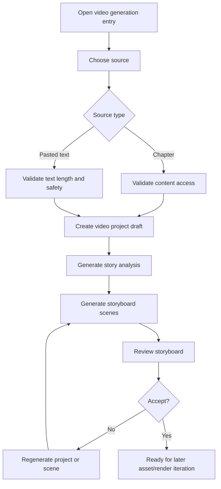
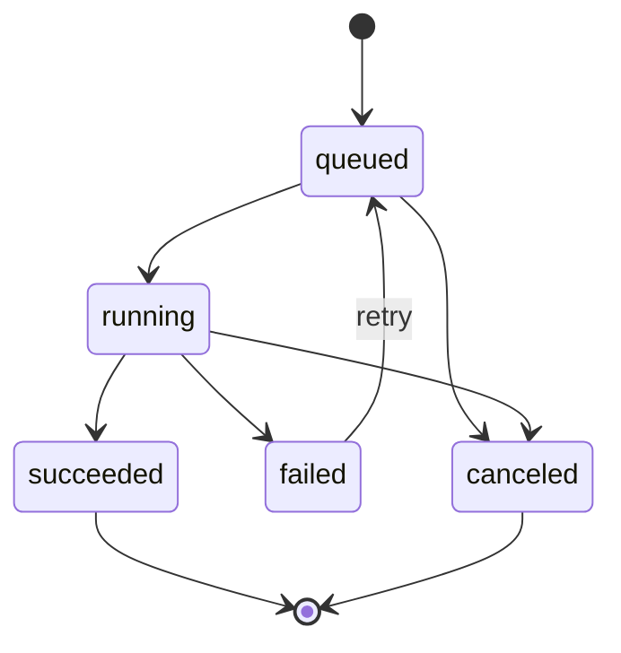

# Short Video Generation RFC

Status: Draft; Iteration 2 backend skeleton completed

Owner domain: AI/media design

Primary roles: author, reader, admin

Related workflow: `09-iteration-workflow.md`

Related skill: `docs/ai-skills/create-reading-feature.md`

## 1. Goal

Design a feature that can generate a short vertical video plan from novel content, a story, or an article.

The first implementation should not try to generate a full video immediately. The safest MVP is:

```text
input text or chapter -> AI story analysis -> storyboard scenes -> saved video project draft
```

Only after this path is stable should later iterations add image generation, voice generation, subtitles, FFmpeg rendering, download, and direct video-generation providers.

## 2. Non-Goals

This RFC does not implement code.

This RFC does not:

- Initialize a new framework or app.
- Change the API envelope.
- Change existing routes.
- Store user-supplied provider API keys.
- Call real image, voice, or video-generation providers.
- Add payment, membership, publishing, or distribution to external short-video platforms.
- Decide production object storage or CDN configuration.
- Replace the existing AI chat feature.

## 3. Product Positioning

The feature should support two primary scenarios:

| Scenario | User | Value |
| --- | --- | --- |
| Author promotion | Author | Turn a chapter or synopsis into a short promotional video draft. |
| Reader sharing | Reader | Turn a favorite public chapter excerpt or pasted story into a shareable story video draft. |

Admin needs visibility into jobs, provider errors, usage, and unsafe content flags.

## 4. Input Sources

Initial sources:

1. Existing public novel chapter.
2. Author-owned novel/chapter draft or approved content.
3. Pasted story/article text.

Recommended first limits:

| Field | Limit |
| --- | --- |
| Input text length | 500 to 3000 Chinese characters for MVP. |
| Video duration target | 30 to 90 seconds. |
| Scene count | 4 to 8 scenes. |
| Scene duration | 4 to 12 seconds each. |
| Aspect ratio | 9:16 vertical. |
| Language | Chinese first; English can be later. |

Rejected inputs:

- Empty or too-short text.
- Unsafe HTML/script payloads.
- Text the user cannot access.
- Chapter content hidden by permission/status rules.
- Provider API key or secret submitted as part of content.

## 5. MVP Output

The first shippable MVP should produce:

- Project title.
- Source summary.
- Target audience.
- Narrative hook.
- Scene list.
- Per-scene visual prompt.
- Per-scene narration.
- Per-scene subtitle.
- Per-scene duration.
- Style preset.
- Status and failure reason.

It should not produce image/audio/video files in the first implementation slice.

## 6. User Flow



## 7. Future Full Generation Flow

Later iterations can extend the pipeline:

```text
storyboard -> image assets -> narration audio -> subtitles -> background music -> FFmpeg render -> MP4 download
```

Direct text-to-video providers should be a later optional rendering path, not the base MVP.

Reason:

- Storyboard generation is cheaper and easier to verify.
- Image + TTS + subtitles + FFmpeg is more controllable than direct text-to-video.
- Direct video-generation providers are slower, more expensive, and harder to debug.

## 8. Permission Model

| Action | Public | Reader | Author | Reviewer | Admin/staff/superuser |
| --- | --- | --- | --- | --- | --- |
| Create from pasted text | No | Own | Own | Own if logged in | All |
| Create from public approved chapter | No | Own | Own | Own if logged in | All |
| Create from author draft/rejected chapter | No | No | Own content only | No | All |
| View project | No | Own | Own | Own if creator | All |
| Regenerate project/scene | No | Own | Own | Own if creator | All |
| Render final video | No | Own, if enabled | Own, if enabled | Own, if enabled | All |
| Inspect job/provider logs | No | No | No | No | All |
| Delete project | No | Own | Own | Own if creator | All |

Rules:

- Backend is the source of truth for ownership and content access.
- Frontend entry points are UX only and do not replace server-side checks.
- Pasted text projects belong to the creating user.
- Chapter projects must record source identity and source snapshot metadata.
- Admin can inspect or disable unsafe projects.

## 9. Proposed Domain Model

Future app name: `video_generation`

The name is intentionally English and domain-specific.

### `video_project`

Represents a user-created generation project.

Fields:

- `id`
- `owner_id`
- `source_type`: `chapter`, `novel`, `text`
- `source_novel_id`
- `source_chapter_id`
- `source_title`
- `source_excerpt_hash`
- `input_text`
- `title`
- `summary`
- `style_preset`
- `duration_target`
- `aspect_ratio`
- `status`: `draft`, `analyzing`, `storyboard_ready`, `asset_generating`, `rendering`, `completed`, `failed`, `canceled`
- `failure_reason`
- `created_at`
- `updated_at`
- `deleted_at`

Notes:

- `input_text` may be large and should not be returned in list APIs.
- If copyright/storage policy becomes stricter, store a snapshot excerpt instead of full chapter text for chapter-sourced projects.
- Add indexes on `owner_id`, `status`, `source_type`, and `created_at`.

### `video_scene`

Represents one storyboard scene.

Fields:

- `id`
- `project_id`
- `scene_no`
- `title`
- `visual_prompt`
- `narration_text`
- `subtitle_text`
- `duration_seconds`
- `camera_direction`
- `mood`
- `status`: `draft`, `ready`, `failed`
- `failure_reason`
- `created_at`
- `updated_at`

Constraints:

- Unique `project_id + scene_no`.
- Scene duration must be positive.

### `video_asset`

Represents generated or uploaded media assets.

Fields:

- `id`
- `project_id`
- `scene_id`
- `asset_type`: `image`, `audio`, `subtitle`, `music`, `video`
- `storage_path`
- `provider`
- `provider_asset_id`
- `status`: `queued`, `running`, `ready`, `failed`
- `metadata`
- `created_at`
- `updated_at`

MVP note:

- This model is not needed for the first storyboard-only implementation.

### `video_render_job`

Represents a long-running generation or render job.

Fields:

- `id`
- `project_id`
- `job_type`: `analysis`, `storyboard`, `image`, `tts`, `subtitle`, `render`
- `status`: `queued`, `running`, `succeeded`, `failed`, `canceled`
- `progress`
- `attempt_count`
- `error_code`
- `error_message`
- `started_at`
- `finished_at`
- `created_at`
- `updated_at`

### `video_usage_log`

Records provider usage and safety events.

Fields:

- `id`
- `project_id`
- `user_id`
- `provider`
- `operation`
- `model`
- `input_units`
- `output_units`
- `cost_estimate`
- `status`
- `error_code`
- `created_at`

Sensitive fields such as provider tokens, API keys, phone, and email must not be stored.

## 10. API Draft

Use the current implemented API convention:

- Base route: `/api/`
- Success envelope: `{ "code": 0, "message": "success", "data": ... }`
- Pagination: `{ count, next, previous, results }` inside `data`

Future endpoint draft:

| Method | Endpoint | Permission | Purpose |
| --- | --- | --- | --- |
| `POST` | `/api/video-projects/` | logged-in user | Create a project from text or source content. |
| `GET` | `/api/video-projects/` | owner/admin | List own projects. |
| `GET` | `/api/video-projects/{id}/` | owner/admin | Get project detail and scenes. |
| `POST` | `/api/video-projects/{id}/analyze/` | owner/admin | Generate story analysis. |
| `POST` | `/api/video-projects/{id}/storyboard/` | owner/admin | Generate storyboard scenes. |
| `POST` | `/api/video-scenes/{id}/regenerate/` | owner/admin | Regenerate one scene. |
| `POST` | `/api/video-projects/{id}/render/` | owner/admin | Start final render in a later phase. |
| `GET` | `/api/video-render-jobs/{id}/` | owner/admin | Poll long-running job state. |
| `DELETE` | `/api/video-projects/{id}/` | owner/admin | Soft-delete a project. |
| `GET` | `/api/admin/video-projects/` | admin | Admin list and moderation view. |

### `POST /api/video-projects/` Request Draft

```json
{
  "source_type": "text",
  "source_novel_id": null,
  "source_chapter_id": null,
  "input_text": "story or article text",
  "title": "optional project title",
  "style_preset": "cinematic_story",
  "duration_target": 60,
  "aspect_ratio": "9:16"
}
```

Validation:

- `source_type` is required.
- `source_type` must be one of `text`, `chapter`, or `novel`.
- `input_text` is required only for `text`.
- `source_chapter_id` is required for `chapter`.
- `duration_target` defaults to 60 and should be constrained to 30-90 for MVP.
- `aspect_ratio` defaults to `9:16`.
- User must have source access.

### Detail Response Draft

```json
{
  "code": 0,
  "message": "success",
  "data": {
    "id": 1,
    "title": "Project title",
    "source_type": "chapter",
    "source_title": "Chapter title",
    "summary": "Story summary",
    "style_preset": "cinematic_story",
    "duration_target": 60,
    "aspect_ratio": "9:16",
    "status": "storyboard_ready",
    "failure_reason": "",
    "scenes": [
      {
        "id": 10,
        "scene_no": 1,
        "title": "Opening hook",
        "visual_prompt": "Vertical cinematic scene...",
        "narration_text": "Narration line",
        "subtitle_text": "Subtitle line",
        "duration_seconds": 8,
        "mood": "suspense",
        "status": "ready"
      }
    ]
  }
}
```

## 11. Provider Strategy

Recommended phases:

| Phase | Provider dependency | Output |
| --- | --- | --- |
| Phase A | LLM only | Story analysis and storyboard. |
| Phase B | Image generation | Scene images. |
| Phase C | TTS | Narration audio. |
| Phase D | Local FFmpeg | MP4 from images, narration, subtitles, and music. |
| Phase E | Optional text-to-video provider | Provider-rendered clips. |

Rules:

- Provider configuration should be server-side environment/config, not stored from user input.
- User-supplied keys may be acceptable for the existing AI chat feature, but long-running project generation should not persist user keys.
- Provider calls must log model, operation, success/failure, and usage, but not secrets.
- Timeouts and retry limits must be explicit.

## 12. Storage Strategy

MVP storyboard-only storage:

- Database rows only.
- No binary media files.

Later media storage:

| Environment | Storage |
| --- | --- |
| Local development | Local media directory. |
| Staging/production | Object storage or media service. |

Rules:

- Store generated files outside source code.
- Keep storage paths in database, not raw binary blobs.
- Add cleanup policy for failed/canceled jobs.
- Define max project count and max storage usage per user before enabling real rendering.

## 13. Frontend Draft

Potential routes:

| Route | Purpose |
| --- | --- |
| `/video-projects` | User project list. |
| `/video-projects/create` | Create from text/chapter. |
| `/video-projects/[id]` | Storyboard review and later render progress. |
| `/author/novels/[id]/video-projects/create` | Author entry from owned novel/chapter. |
| `/admin/video-projects` | Admin moderation and troubleshooting. |

Required states:

- loading project,
- empty project list,
- invalid input,
- source permission denied,
- AI generation queued/running,
- generation failed with retry,
- storyboard ready,
- render disabled until later phase,
- deleted/canceled project.

Mobile behavior:

- Creation and storyboard review should be mobile-first.
- Scene cards should be scan-friendly with stable dimensions.
- Admin list can use horizontal scrolling tables.

## 14. Safety And Compliance

Required controls:

- Strip or reject unsafe HTML/script.
- Enforce source ownership and access.
- Limit input length and job frequency.
- Do not log full user input in application logs.
- Mask sensitive fields in traces.
- Record audit events for create, regenerate, render, delete, admin disable, and provider failure if business state changes.
- Add content safety flags before public sharing or platform publishing exists.
- Add copyright/product policy review before allowing video generation from content the user does not own.

Open policy decision:

- Readers may generate private drafts from public content, but public export/sharing may need stricter author/admin rules.

## 15. Async Job Lifecycle



Rules:

- Jobs should be idempotent where possible.
- Retrying a scene should not overwrite the last good scene until the new result succeeds.
- A project should expose the latest usable output even if a later regeneration fails.
- Long-running jobs should be polled by job ID.

## 16. Iteration Plan

### Iteration 1: RFC And Contract Planning

Deliverable:

- This RFC.
- Roadmap and feature-spec references.

Acceptance:

- Scope, non-goals, data model draft, API draft, permission matrix, and risks are documented.

### Iteration 2: Storyboard Data Model And Backend Skeleton

Status: first backend pass completed.

Deliverable:

- `video_generation` backend domain. Completed.
- Models for project and scene. Completed.
- Create/list/detail/delete APIs for text-sourced projects. Completed.
- Admin list/detail APIs. Completed.
- No external provider call yet. Preserved.

Acceptance:

- User can create a project from pasted text. Completed.
- Backend permissions and envelope are correct. Completed.
- Admin can inspect projects. Completed.
- Smoke tests cover create/list/detail/admin visibility/unsafe input/soft delete audit. Completed.

### Iteration 3: AI Storyboard Generation

Deliverable:

- Server-side provider config.
- Story analysis and scene generation service.
- Job status and retry for analysis/storyboard.

Acceptance:

- Text input generates 4-8 scenes.
- Failures are visible and retryable.
- Provider secrets are not exposed or stored from user input.

### Iteration 4: Chapter Source Integration

Deliverable:

- Create from public approved chapter.
- Create from author-owned chapter/draft.
- Source access checks.

Acceptance:

- Readers cannot use hidden/private chapters.
- Authors can use their own drafts.
- Admin can inspect all projects.

### Iteration 5: Image, Voice, And Subtitle Assets

Deliverable:

- Scene image generation.
- Narration TTS.
- Subtitle asset generation.
- Asset table and storage policy.

Acceptance:

- Each scene can reach asset-ready state.
- Failed asset generation does not destroy storyboard data.

### Iteration 6: FFmpeg Render And Download

Deliverable:

- Final MP4 render.
- Download endpoint.
- Progress polling.

Acceptance:

- A project can render a 9:16 MP4 locally.
- Failed renders are retryable.
- Files are stored outside source code.

### Iteration 7: Moderation, Quota, And Usage

Deliverable:

- Quota limits.
- Usage logs.
- Admin moderation controls.

Acceptance:

- Abuse and runaway cost risks are bounded.
- Admin can disable unsafe projects.

## 17. Verification Plan

Docs-only RFC verification:

```powershell
Get-ChildItem docs\spec-coding
```

Future backend verification:

```powershell
cd services/api
.\.venv\Scripts\python.exe manage.py check
.\.venv\Scripts\python.exe manage.py makemigrations --check --dry-run
.\.venv\Scripts\python.exe manage.py test common --noinput
```

Future frontend verification:

```powershell
cd apps/web
npx.cmd tsc --noEmit --incremental false
npm.cmd run lint
npm.cmd run build
```

Manual scenarios for future implementation:

- Create from pasted text as reader.
- Create from own chapter as author.
- Reject access to another author's draft.
- Poll storyboard job to success.
- Retry a failed scene.
- Admin list shows project and failure reason.
- No provider secret appears in response or logs.

## 18. Open Decisions

These decisions must be resolved before implementation beyond storyboard-only MVP:

1. Which server-side LLM provider and model should be configured?
2. Should readers be allowed to export videos from public chapters, or only private drafts?
3. What is the allowed daily generation quota per role?
4. Where will media files be stored in staging/production?
5. Should generated videos require admin/moderation review before download or public sharing?
6. What content safety policy applies to violent, adult, copyrighted, or sensitive story content?
7. Should author-owned content receive priority quota or branding templates?

## 19. Main Risks

| Risk | Mitigation |
| --- | --- |
| Provider cost grows quickly | Start with storyboard-only MVP, add quotas before rendering. |
| Long-running jobs fail often | Use explicit job states, retry limits, and failure reasons. |
| User secrets leak | Do not store user-supplied provider keys; mask sensitive logs. |
| Users generate from content they should not access | Enforce backend source permission checks. |
| Media storage becomes unbounded | Add storage quotas and cleanup policy before rendering. |
| Direct video model output is inconsistent | Prefer storyboard -> image/TTS/FFmpeg first. |
| Copyright/public sharing ambiguity | Keep early outputs private drafts until policy is approved. |

## 20. Recommended Next Iteration

Next recommended iteration:

```text
Iteration 3 - AI Storyboard Generation
```

Reason:

- The project ownership, source validation, status lifecycle, API envelope, migrations, and smoke tests are now in place for text-sourced drafts.
- The next useful slice is a server-side storyboard generator that produces 4-8 draft scenes without introducing image/audio/video rendering yet.
